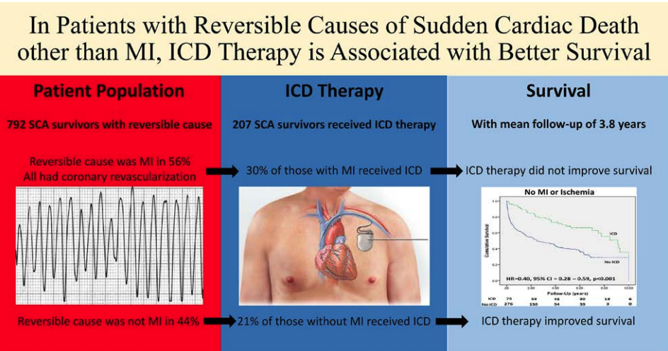

```{r setup, echo = FALSE, include = FALSE}
library(tidyverse)

print.tbl_df <- function(x, ...) {
	print.data.frame(x, right = FALSE, ...)
	invisible(x)
}

# Options
options(digits = 0)
```

```{r themer, echo=FALSE, include=FALSE, warning=FALSE}
library(xaringanthemer)
style_duo_accent(primary_color = "#091F40", secondary_color = "#AC1E2D")
```

class: center, middle, inverse
# Case 1
91 year old veteran p/w NSTEMI

---
background-image: url("V5846-initial.gif")
background-size: contain

---
background-image: url("V5846-rca-collateral.gif")
background-size: contain

---
background-image: url("V5846-rca-collateral-2.gif")
background-size: contain

---
background-image: url("V5846-cross-lesion.gif")
background-size: contain

---
background-image: url("V5846-first-balloon.gif")
background-size: contain

---
background-image: url("V5846-stent-placed.gif")
background-size: contain

---
background-image: url("V5846-second-stent.gif")
background-size: contain

---
background-image: url("V5846-preparing-kiss.gif")
background-size: contain

---
background-image: url("V5846-dk-balloon.gif")
background-size: contain

---
background-image: url("V5846-timi-3.gif")
background-size: contain

---
.pull-left[
### Access
Right radial 7F  
Left radial 6F  
6F AL 0.75 in RCA  
7F XB 3.5 in LM  

### Interventions
IVUS to identify proximal LAD CTO cap  
Wire escalation with Hornet 15  
Mongo to access true lumen  
Step crush LAD/D1 bifurcation  
- D1 = 3.5x24 DES
- LAD = 3.5x12, 3.0x38, 2.75x38
]

.pull-right[
### Outcomes
Success LAD CTO PCI  
Successful LAD/D1 bifurcation PCI  
DAPT, statin, BB, and follow-up with cardiology  
]

---
class: center, middle, inverse
# Case 2

Outpatient with ICM, EF 45%, decreased exercise tolerance, known CABGx2V (LIMA-LAD, SVG-RCA)

---
background-image: url("L7332-LM-CTO.gif")
background-size: contain

---
background-image: url("L7332-lima.gif")
background-size: contain

---
background-image: url("L7332-first-dual-injection.gif")
background-size: contain

---
background-image: url("L7332-blind-wire.gif")
background-size: contain

---
background-image: url("L7332-sequential-balloon.gif")
background-size: contain

---
background-image: url("L7332-retrograde-filling.gif")
background-size: contain

---
background-image: url("L7332-place-balloon.gif")
background-size: contain

---
background-image: url("L7332-LAO-90.gif")
background-size: contain

---
background-image: url("L7332-fukushima-balloon.gif")
background-size: contain

---
background-image: url("L7332-post-stent.gif")
background-size: contain

---
background-image: url("L7332-final-shot.gif")
background-size: contain

---
.pull-left[
### Access
Right femoral 7F  
Left femoral 6F  
4F Terumo Tiger for dx, 7F XB 3.5 in LM
4F JR-4 in LIMA

### Interventions
Tubular lesion of mid-LAD visualized through LIMA  
Fielder XT with Corsair to cross LM-CTO  
Sequential balloon dilations (1-2 mm) to cross  
PCI of mid-LAD with 3.0x188 Resolute Onyx  
- Heavy LAO for placement guidance
]

.pull-right[
### Outcomes
Success LAD CTO POBA   
Successful mLAD PCI  
Continue DAPT x 1 year, follow-up in clinic
]

---
class: center, middle, inverse
# Case 3
71 year old male with VF arrest in ophthalmology clinic, PVD and DM

---
background-image: url("S2769-arteria-lusoria.gif")
background-size: contain

---
background-image: url("S2769-prox-RCA-CTO.gif")
background-size: contain

---
background-image: url("S2769-mid-LAD-99.gif")
background-size: contain

---
background-image: url("S2769-LAO-crani.gif")
background-size: contain

---
background-image: url("S2769-LAO-caudal.gif")
background-size: contain

---
background-image: url("S2769-first-balloon.gif")
background-size: contain

---
background-image: url("S2769-stented.gif")
background-size: contain

---
background-image: url("S2769-timi-3.gif")
background-size: contain

---
.pull-left[
### Access
6F Right Radial  
6F Left Radial  
5F JR-4 in RCA
6F JL-4 in LCA

### Interventions
Arteria lusoria was crossed from right  
From left, BMW and then Wiggle wire to cross LAD lesion   
Guideliner used to place stent  
3.0x38 Resolute Onyx placed, post-dil with 3.5 NC  
IVUS used to visualize edge of lesion  
Small diagonal was jailed/sacrificed
]

.pull-right[
### Outcomes
Success PCI of LAD lesion  
DAPT x 12 months   
New-onset AF (potential dual therapy of clopidogrel/DOAC)  
Avoid right radial d/t arteria lusoria in future  
Staged PCI of LCX/OM  
May need RCA CTO PCI as outpatient  
]

---

class: center, middle

<font color="red">Should this person get an ICD?</font>

.left[
.footnote[Ladejobi et al. 2018, Circulation: Arrhythmia & Electrophysiology]
]