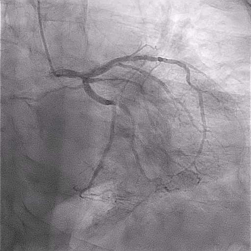
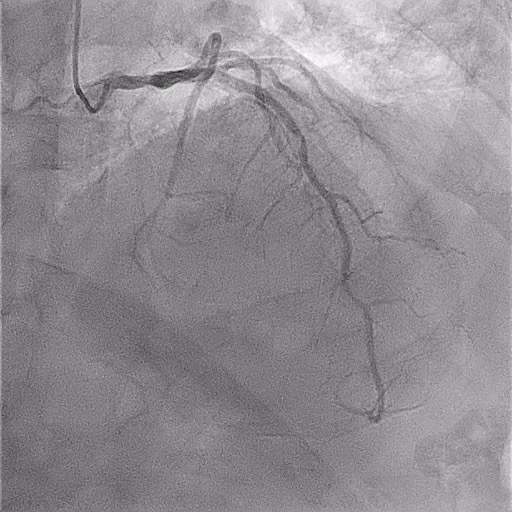
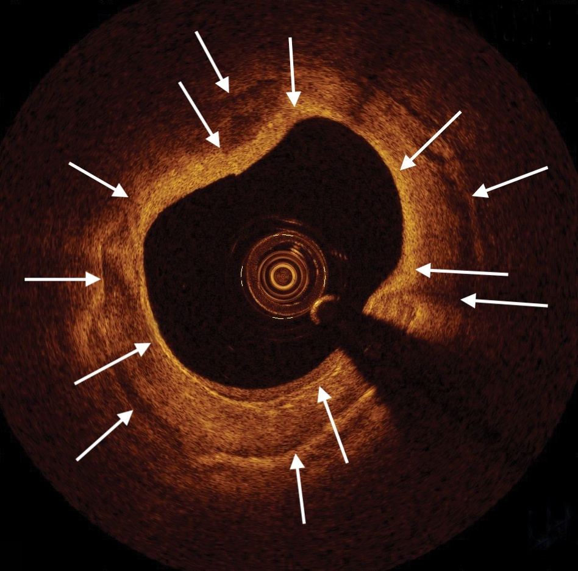
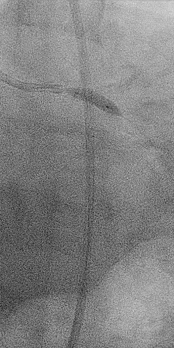
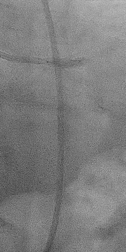
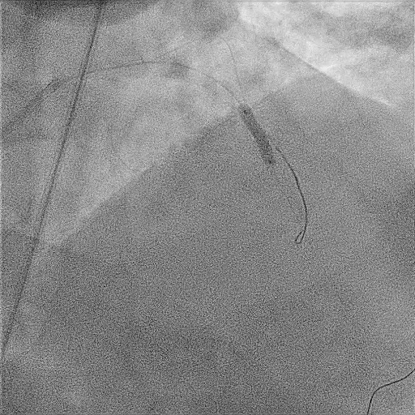
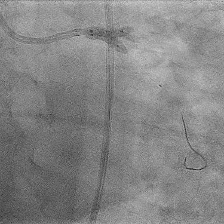
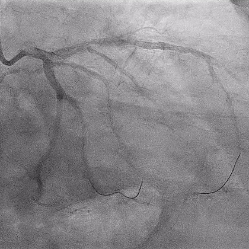

```{r setup, echo = FALSE, include = FALSE}
library(tidyverse)

print.tbl_df <- function(x, ...) {
	print.data.frame(x, right = FALSE, ...)
	invisible(x)
}

# Options
options(digits = 0)
knitr::opts_chunk$set(
  echo = FALSE,
  eval = TRUE
)
```

```{r themer, echo=FALSE, include=FALSE, warning=FALSE}
library(xaringanthemer)
style_duo_accent(primary_color = "#091F40", secondary_color = "#AC1E2D")
```

## 69 year old male for pre-operative risk

.pull-left[
History:
- Peripheral vascular disease with left lower extremity gangrene 
- End-stage renal disease
- Hypertension
- Diabetes mellitus

Physical:
- Vitals =  89 beats/min, 146/66, BMI 32
- Normal rate and regular rhythm
- Diminished distal pulses with left upper extremity fistula
- Left lower leg with Lisfranc amputation 
]

.pull-right[
Non-invasive findings:
- ECG with normal sinus rhythm, borderline LVH
- Dobutamine stress echocardiogram with normal LV function at rest
- Severe inferior, anterior, lateral apical wall hypokinesis at stress

Diagnostic angiography:
- Distal LM 50% lesion
- Extends into ostial LAD and ostial LCX, with 70% calcific lesions
- Medina 1,1,1 category
- Mid-LAD with 50% focal lesion
- Nonobstructive disease of RCA
]

---
class: middle

.left-column[
- LM, Medina 1,1,1
]

.center[.right-column[
```{r, out.width='90%'}

```

_Surgical turn-down for CABG due to active infection._
]]

---
class: middle

.left-column[
- LM, Medina 1,1,1  
- Mid-LAD 90% 
]

.right-column[
```{r}

```
]

---
class: middle

.left-column[
- LM, Medina 1,1,1  
- Mid-LAD 90% 
- OCT of both lesions with $360^\circ$ Ca++
]

.center[.right-column[
```{r, out.width='90%'} 

```

_Nearly circumferential calcium (arrows)_
]]

---
class: middle

.left-column[
- LM, Medina 1,1,1  
- Mid-LAD 90% 
- OCT of lesions with $360^\circ$ Ca++
- Shockwave to ostial LCX and LAD

]

.center[.right-column[
```{r, out.width='40%'}


```

_Given large, significantly calcified LCX, favored a 2-stent strategy with plaque modification to both branches, followed by DK-Crush after stenting mid-LAD lesion. Shockwave was used to leave both wires in place._

]]

---
class: middle

.left-column[
- LM, Medina 1,1,1  
- mLAD 90% 
- OCT of lesions with $360^\circ$ Ca++
- Shockwave to ostial LCX and LAD
- DES to mid-LAD
]

.right-column[
```{r}

```
]

---
class: middle

.left-column[
- LM, Medina 1,1,1  
- mLAD 90% 
- OCT of lesions with $360^\circ$ Ca++
- Shockwave to ostial LCX and LAD
- DES to mid-LAD
- DES in LCX, crushed by LAD balloon, and initial kiss
]

.right-column[
```{r, out.width='110%'}

```
]

---
class: middle

.left-column[
- LM, Medina 1,1,1  
- mLAD 90% 
- OCT of lesions with $360^\circ$ Ca++
- Shockwave to ostial LCX and LAD
- DES to mid-LAD
- DES in LCX, crushed by LAD balloon, and initial kiss
- DES to LAD, followed by final kiss
]

.right-column[
```{r, out.width='110%'}

```
]

---

.pull-left[
### Hospital Course

- Day 1: Admitted to hospital for worsening gangrene requiring amputation
- Day 3: Diagnostic angiography performed for pre-operative risk stratification
- Day 6: Successful revascularization of bifurcation disease after surgical turn-down
- Day 7: Taken to operating room for above-knee amputation
- Day 14: Discharged from hospital to sub-acute rehab center
]

.pull-right[
### Learning Points

- OCT imaging to help identify heavily Ca++ lesions
- Shockwave, versus atherectomy, allows for initial ballooning to access distal lesions with $\downarrow$ embolization or proximal complications 
- Shockwave, versus orbital atherectomy, allows wire position maintenance
- Effective modification of $360^{\circ}$ Ca++ 
- DK Crush with Shockwave allows for $\uparrow$ safety, $\downarrow$ procedure duration, and $\downarrow$ complexity compared to traditional atherectomy approach
]