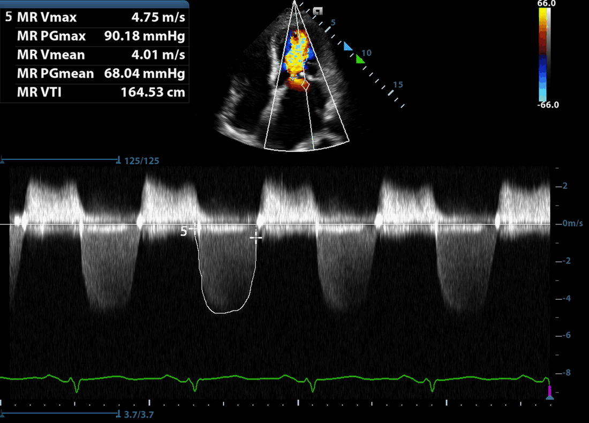
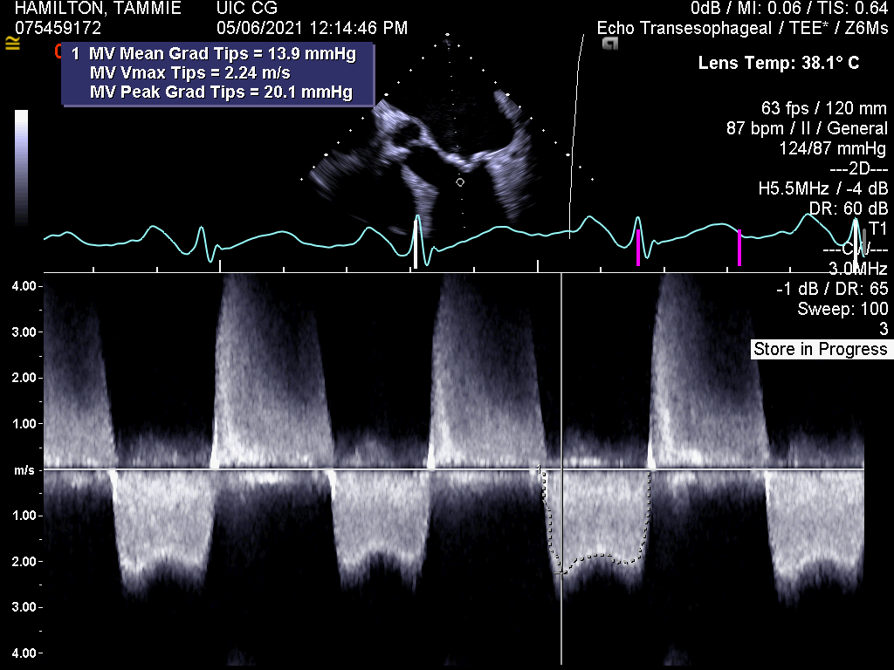
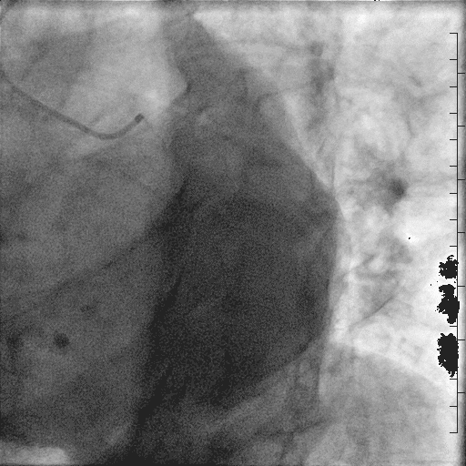
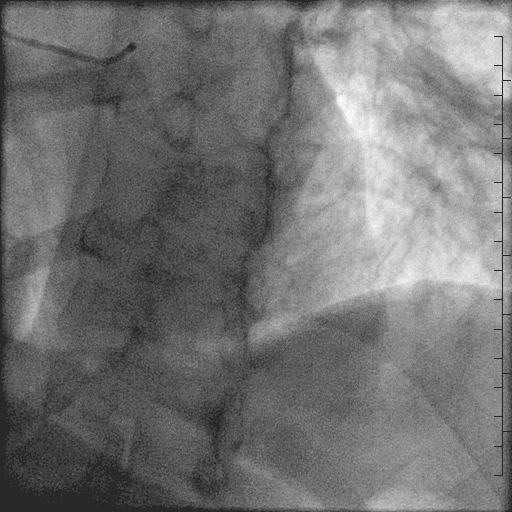
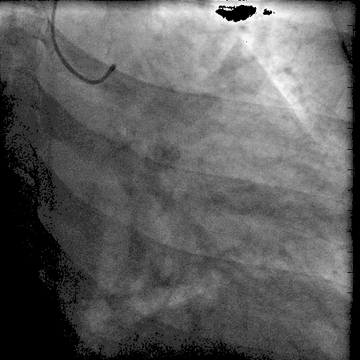
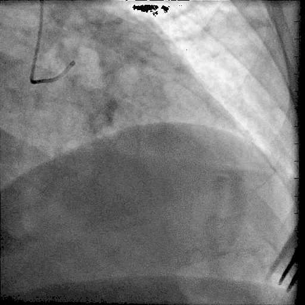
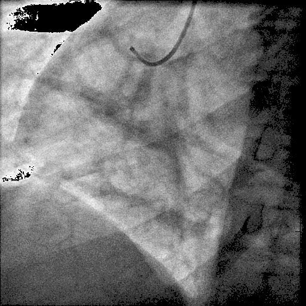
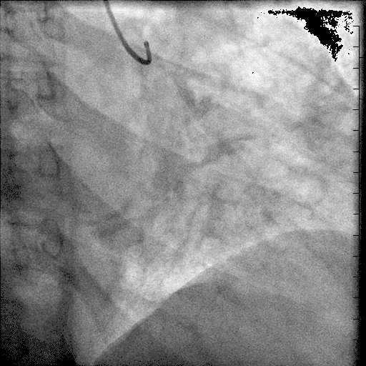
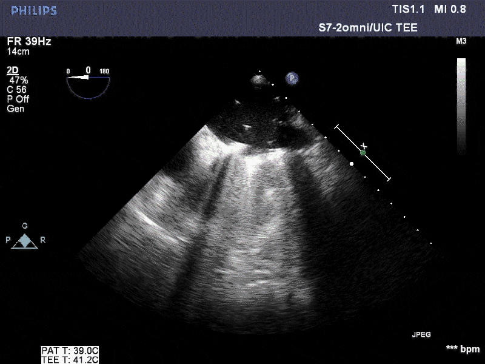
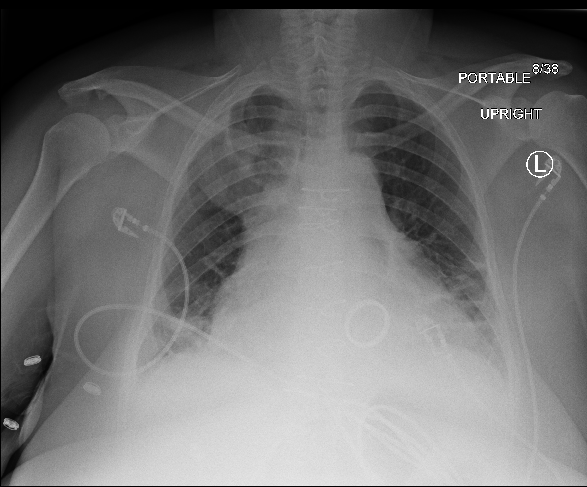

```{r setup, echo = FALSE, include = FALSE}
library(tidyverse)

print.tbl_df <- function(x, ...) {
	print.data.frame(x, right = FALSE, ...)
	invisible(x)
}

# Options
options(digits = 0)
```

```{r themer, echo=FALSE, include=FALSE, warning=FALSE}
library(xaringanthemer)
#style_duo_accent(primary_color = "#091F40", secondary_color = "#AC1E2D")
style_duo_accent(
  primary_color = "#838383",
  secondary_color = "#5c131b",
  white_color = "#ffffff",
  black_color = "#1a1a13"
)
```

```{r, references, include=FALSE, cache=FALSE}
library(RefManageR)
BibOptions(
	check.entries = FALSE,
	style = "markdown",
	bib.style = "authoryear",
	max.names = 2,
	hyperlink = FALSE
)
# Current directory
bibfile <- here::here("Cardiology", "10-18-12_m&m-conference", "Cardiology.bib")
bib <- ReadBib("Cardiology.bib", check = FALSE)
```

```{r, m&m, echo=FALSE}
mortality <- list(
  ascvd_life = "39%",
  ascvd_10 = "0.6%",
  ms_01 = "8%",
  ms_10 = "39-70%",
  ms_20 = "79-83%", 
  afib = "40%",
  embolic = "9-14%",
  wilkins_low = "<=8",
  wilkins_high = ">8",
	dissection = "0.2-0.6%",
  rrt = "15%",
  pea = "84-90%",
  cpr_freq = "<2%",
  cpr = "46%"
)
```

class: inverse, middle, left
# History

---

.pull-left[
#### Presentation
- _TH_ is a 38 year old female who presents as a transfer from OSH with increasing shortness of breath, with history of __mitral stenosis__
- Notes worsening bilateral leg swelling, dyspnea at rest, and orthopnea
- Denies chest pain, nausea, vomiting, or diaphoresis
- Denies any prior blood clots, estrogen use, or hemoptysis
- Was at OSH for recent pneumonia, s/p antibiotic therapy
]

.pull-right[
#### Prior histories
- Past history included iron-deficiency anemia, asthma, hyperlipidemia, and __left ventricular hypertrophy__
- Significant family history of cardiovascular disease, including brother, sister, and father with __heart failure__, and mother with hypertension and a pacemaker
- Reports smoking starting in early 20s
]

---
class: inverse, middle, left
# Physical

---

.pull-left[
#### Exam

- VS: heart rate of 70, blood pressure of 112/78, 97% on room air
- Gen: young-appearing woman in no acute distress
- CV: CVP of 10 cm H20, S1/S2, III/VI apical diastolic murmur
- Pulm: diminished breath sounds in bases
- GI: soft abdomen without tenderness or organomegaly
- Neuro: alert and oriented, no neurological deficits
]

.pull-right[
#### Studies

- Creatinine 0.7
- Potassium 3.7 
- Magnesium 1.7
- __Hemoglobin 10__
- CXR with no pulmonary infiltrates, potential cardiomegaly
- ECG is NSR with LAE and IVCD
- TTE with mitral stenosis
]

---
class: inverse, left
## Risk


- Based on demographic/clinical risk factors, _TH_ has a lifetime ASCVD risk of `r mortality$ascvd_life`, and a 10-year risk of `r mortality$ascvd_10`
- In setting of mitral stenosis, without intervention, _TH_ has an estimated risk of `r mortality$ms_01` at 1 year, `r mortality$ms_10` at 10 years, and `r mortality$ms_20` at 20 years
- Additional risks include development of atrial fibrillation (`r mortality$afib`) and embolic events (`r mortality$embolic`)

.footnote[`r Citet(bib, author = "Selzer", year = "1972")`]

---
background-image: url("ecg-admission.png")
background-size: contain

---
background-image: url("cxr-first.png")
background-size: cover

---
class: inverse, middle, left
# Echocardiography

---
background-image: url("tte-plax.gif")
background-size: cover

---
background-image: url("tte-plax-mv-bw.gif")
background-size: cover

---
background-image: url("tte-plax-mv-color.gif")
background-size: cover

---
background-image: url("tte-a4c.gif")
background-size: cover

---
background-image: url("tte-a4c-color.gif")
background-size: cover

---
background-image: url("tte-apical-la.png")
background-size: cover

---
background-image: url("tte-mv-inflows.png")
background-size: cover

---
background-image: url("tte-ivc.png")
background-size: cover

---
background-image: url("tee-mv-0d.gif")
background-size: 120%

---
background-image: url("tee-mv-140d.gif")
background-size: 120%

---
background-image: url("tee-mv-color.gif")
background-size: 120%

---
background-image: url("tee-3D-mv.gif")
background-size: 120%

---
background-image: url("tee-3D-mv.gif")
background-size: 120%

---
background-image: url("tee-3D-no-color.gif")
background-size: 120%

---
background-image: url("tee-3D-with-color.gif")
background-size: 120%

---

.left-column[
- With MR pressure gradient of ~90 mmHg, along with SBP of ~110, can expect a LVEDP of ~20 mmHg
- With mitral inflow velocity of >2 m/s, and mean gradient of ~14 mmHg, classifies as __severe mitral stenosis__
]

.center[.right-column[
```{r, echo=FALSE, out.width='70%'}


```
]]

---
class: inverse, left
## Risk

The echocardiographic findings help to assess potential interventional strategies. For balloon valvuloplasty, the _Wilkin's Score_ classifies risk. Criteria:

- Leaflet mobility
- Valve thickness
- Subvalvular thickening
- Valvular calcification

A score `r mortality$wilkins_high` suggests worse procedural risk, while a score of `r mortality$wilkins_low` suggests favorable short and long-term outcomes. 

.footnote[`r Citet(bib, author = "Wilkins", year = "1988")`]

---
class: inverse, middle, left
# Coronary Angiography

---
class: center, middle

```{r, echo=FALSE, out.width='50%'}


```

Diagnostic __coronary angiography__ revealed normal left main, left anterior descending, and left circumflex arteries.

---
class: center, middle

```{r, echo=FALSE, out.width='50%'}


```

No obstructive disease in selective angiography of left coronary artery.

---
class: center, middle

```{r, echo=FALSE, out.width='50%'}


```

Selective angiography of the right coronary artery revealed normal coronaries with right-dominant circulation.

---

### Right/Left Heart Catheterization

.pull-left[

```{r}
# Measurements
RA = 19
RVSP = 71
RVEDP = 20
PASP = 70
PADP = 39
MPAP = 52
PWCP = 44
LVSP = 129
LVDP = 93
LVEDP = 19

# Hemodynamics
CO = 4.4
CI = 2.1
SV = 64
SVR = 1650
MVG = 17
MVA = 0.95
```
]

.pull-right[
- Low normal cardiac output/indices
- Moderately elevated RV and PA pressures
- Severely elevated mean PA pressures, and severely elevated wedge pressures (__group 2 pulmonary hypertension__)
- Mildly increased SVR
- Severe __mitral stenosis__ by elevated gradient and estimate valve area
]

---
class: inverse, left
## Risk

Other criteria that increase the risk with PBMV mortality include:

- Mitral regurgitation
- Increased PA pressures
- NYHA functional class IV

In those with Wilkin's score `r mortality$wilkins_high`, mitral valve surgery has improved long-term outcomes.

.footnote[
`r Citet(bib, author = "Ambari", year = "2019")`  
`r Citet(bib, author = "Palacios", year = "2020")`  
]

---
background-image: url("ct-chest.gif")
background-size: cover

---
background-image: url("ct-aorta.png")
background-size: cover

---
class: inverse, left
# Hospital Course

1. Admission on _Day 1_ as OSH transfer for MS evaluation
1. Evaluation for mitral stenosis begins, including TEE, left and right heart catheterization, coronary angiography
1. Evaluation for mechanical mitral valve replacement versus percutaneous balloon mitral valvuloplasty
1. Patient chooses mechanical mitral valve, along with life-long AC
1. On _Day 8_, patient undergoes surgical mitral valve replacement

---
## Surgical mitral valve replacement

.pull-left[
1. Median sternotomy.
1. Total cardiopulmonary bypass.
1. Mitral valve replacement with a 31 mm Sorin mechanical valve prosthesis.
1. Insertion of temporary bipolar ventricular pacing wire.
1. Insertion of mediastinal and bilateral pleural chest tubes.
]

.center[.pull-right[
```{r, echo=FALSE}

```
]]

---
class: inverse, left
## Risk

There have been case reports of aortic dissection after mitral valve replacement, but the frequency has been unclear. 

Generally, after bypass grafting, the incidence of iatrogenic dissection of the ascending aorta is `r mortality$dissection`

.footnote[`r Citet(bib, author = "Pappas", year = "1998")`]

---

.left-column[
- After undergoing mitral valve replacement, patient was pending discharge on hospital day 14
- She then developed acute hypotension, tachycardia, chest pain, and hypoxia
- RRT was called...
]

.center[.right-column[
```{r, echo=FALSE}

```
]]

---
background-image: url("ecg-death.png")
background-size: contain

---
background-image: url("cxr-code-intubated.png")
background-size: cover

---
class: inverse, left
## Risk

1. Found to be tachcyardic, newly hypoxic, and unable to obtain BP
1. RRT called, with stat bedside TTE showing well-placed mitral valve
1. Started on nor epinephrine, with appropriate blood pressure response
1. Radial arterial access and subclavian venous access were obtained
1. Worsening chest pain and back pain, along with worsening shortness of breath
1. Patient intubatd, and then developed SVT and treated with amiodarone
1. PEA arrest occurred, with ST elevations visualized on telemetry
1. After 1.5 hours of CPR, time of death was declared

_The risk of mortality after an RRT is called is `r mortality$rrt` for all patients._
_The risk of mortality for PEA arrest is `r mortality$pea` in patients under 50 years of age._

.footnote[
`r Citet(bib, author = "Girotra", year = "2020")`  
`r Citet(bib, author = "Shappell", year = "2018")`
]

---
# Differential Diagnosis

.pull-left[
#### Clinical Factors
1. 38 year old female
1. Rheumatic heart disease
1. Severe mitral stenosis
1. Therapeutic LMWH and warfarin
1. Chest and back pain
1. Cold and wet physiology
1. Hypoxia
1. Hypotension/shock
1. Underfilling of LV with dilated IVC
1. ST elevations before PEA arrest
]

.pull-right[
#### Differential
- Pulmonary embolism 
- Valvular leak or dislodgement
- Pericardial effusion / cardiac tamponade
- Aortic dissection, type A
- ST elevation myocardial dissection
- Spontaneous coronary artery dissection
- Sepsis and septic shock
]

---
background-image: url("cpr-after-sternotomy.png")
background-size: contain

---
## CPR after Sternotomy

.pull-left[
#### Basics
- VF/VT = shock x 3, amiodarone, sternotomy
- asystole/bradycardia = pacing, sternotomy
- PEA = turn off pacing to look for VF, sternotomy

]

.pull-right[
#### Exceptions
1. No epinephrine per protocol
1. IABP placed on pressure trigger (instead of electrical)
1. Compressions should be manual, targeting SBP ~ 60 mm Hg, and automated compressions are contraindicated

The frequency of CPR after cardiac surgery has been quoted `r mortality$cpr_freq`, with mortality rates of reported as approximately `r mortality$cpr`, but other studies have noted that mortality until discharge was 80%.

]

.footnote[
`r Citet(bib, author = "Wahba", year = "1997")`  
]

---
class: inverse, middle, left
# End of Case

---
### References

<font size="2">

```{r, refs, echo=FALSE, results="asis"}
PrintBibliography(bib)
```