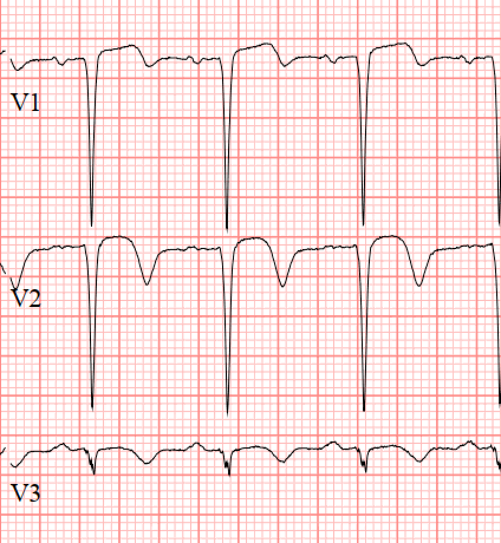
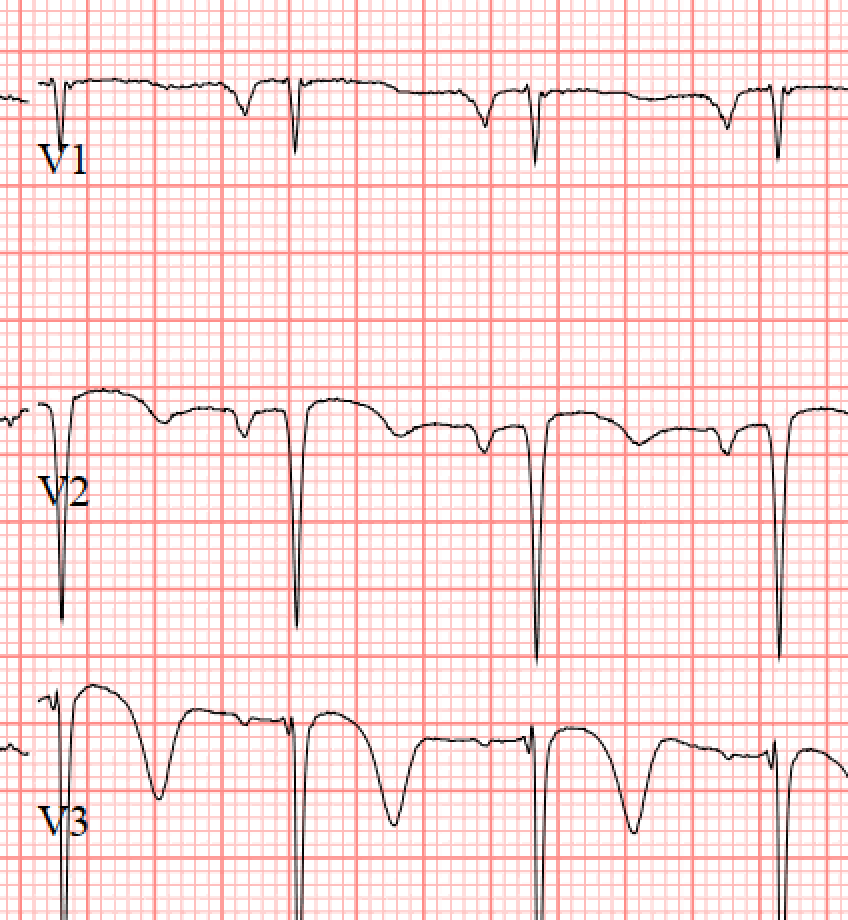

```{r setup, echo = FALSE, include = FALSE}
library(tidyverse)

print.tbl_df <- function(x, ...) {
	print.data.frame(x, right = FALSE, ...)
	invisible(x)
}

# Options
options(digits = 1)
```

```{r themer, echo=FALSE, include=FALSE, warning=FALSE}
library(xaringanthemer)
style_duo_accent(primary_color = "#091F40", secondary_color = "#AC1E2D")
```

.pull-left[
### History

- Ms. LB is a 59 year old woman
- She presents with chest pain overnight - worsening, exertional, and typical
- Past medical history of __hypertension__, __hyperlipidemia__, __diabetes__
- Former drug use, and active __smoker__
- Additional history of untreated HCV, bipolar disorder
- In the emergency room, initial ECG shows concerning TWI in anterior leads
- Cardiology consulted for potential cath lab activation

]

.pull-right[
### Physical

- HR 95 bpm, BP 144/90, 95% on room air
- Thin woman in acute distress, alert and oriented
- +2 radial and +2 femoral pulse bilaterally
- Normal rate, regular rhythm
- S1/S2 with soft systolic murmur
- Initial ECG with Wellen's syndrome type 2, and subsequent ECG with Wellen's type 1
- Bedside echocardiography with anterolateral wall hypokinesis, LVEF of 25%
]

---
class: middle

.pull-left[
```{r}

```
]

.pull-right[
```{r}

```
]

Initial ECG and subsequent ECG approximately 30 minutes apart in setting of persistent chest pain.

---
class: middle

.left-column[
- Right radial artery with vasospasm
- Left radial artery used for 6F introducer sheath with US
- 5F JR-4 used for RCA selective angiography
]

.center[
.right-column[
```{r}

```
]
]
	
---
class: middle

.left-column[
- Exchanged for 5F JL-3.5 over wire
- LCA selective angiography performed in multiple views
]

.center[
.right-column[
```{r}
knitr::include_graphics("lb-02-spider.gif")
```
]
]

---
class: middle

.left-column[
- Ostial LAD deemed culprit lesion
- Started on IV cangrelor and heparin boluses 
- Exchanged to 6F XB-3.5 guide catheter
- BMW wire positioned in distal D1 artery
- Pilot 50 advanced to distal LAD
]

.center[
.right-column[
```{r}

```
]
]

---
class: middle

.left-column[
- Initial angioplasty with 2.5 x 12 mm SC balloon
- IVUS performed showing 360 degree of calcium in ostial LAD
]

.center[
.right-column[
```{r}

```
]
]
	
---
class: middle

.left-column[
- Proceeded with IVL
- 6F guideliner advanced for support
- 4.0 x 12 mm Shockwave balloon positioned
- 1 cycle at 4 atm and 4 cycles at 6 atm performed 
]

.center[
.right-column[
```{r}

```
]
]
	
---
class: middle

.left-column[
- Predilated lesion to 12 atm with NC balloon
]

.center[
.right-column[
```{r}

```
]
]
	
---
class: middle

.left-column[
- 4.0 x 18 mm DES deployed at 14 atm
- Post dilated with 4.5 mm NC balloon 
]

.center[
.right-column[
```{r}

```
]
]
	
---
class: middle

.left-column[
- Diagonal branch mildly pinched but with TIMI-3 flow
- Confirmed TIMI-3 flow in LAD 
- No evidence of dissection, perforation, or distal embolization
]

.center[
.right-column[
```{r}

```
]
]
	
---
class: middle, inverse

# Conclusion

.left[
The highly calcific nature of the ostial LAD benefited from IVL in the setting of a STEMI. The patient did well afterwards, with no further chest pain. Formal echocardiography with anterolateral hypokinesis and LVEF of 25%. Discharged with cardiac rehab, beta blockade, RAAS inhibition. 
]