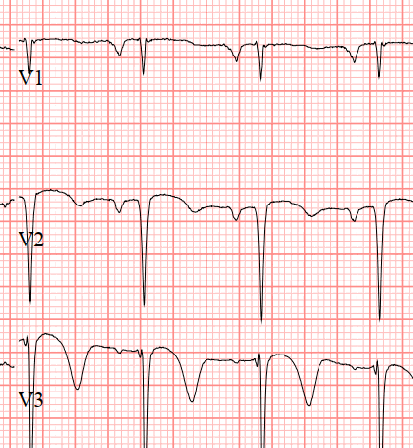

```{r setup, echo = FALSE, include = FALSE}
library(tidyverse)

print.tbl_df <- function(x, ...) {
	print.data.frame(x, right = FALSE, ...)
	invisible(x)
}

# Options
options(digits = 1)
```

```{r themer, echo=FALSE, include=FALSE, warning=FALSE}
library(xaringanthemer)
style_duo_accent(primary_color = "#091F40", secondary_color = "#AC1E2D")
```

.pull-left[
### History

- Ms. LB is a 59 year old woman
- She presents with chest pain overnight - worsening, exertional, and typical
- Past medical history of __hypertension__, __hyperlipidemia__, __diabetes__
- Former drug use, and active __smoker__
- Additional history of untreated HCV, bipolar disorder
- In the emergency room, initial ECG shows concerning TWI in anterior leads
- Cardiology consulted for potential cath lab activation

]

.pull-right[
### Physical

- HR 95 bpm, BP 144/90, 95% on room air
- Thin woman in acute distress, alert and oriented
- +2 radial and +2 femoral pulse bilaterally
- Normal rate, regular rhythm
- S1/S2 with soft systolic murmur
- Initial ECG with Wellen's syndrome type 2, and subsequent ECG with Wellen's type 1
- Bedside echocardiography with anterolateral wall hypokinesis, LVEF of 25%
]

---
class: middle

.pull-left[
```{r}
knitr::include_graphics("lb-ecg-first.png")
```
]

.pull-right[
```{r}

```
]

Initial ECG and subsequent ECG approximately 30 minutes apart in setting of persistent chest pain.

