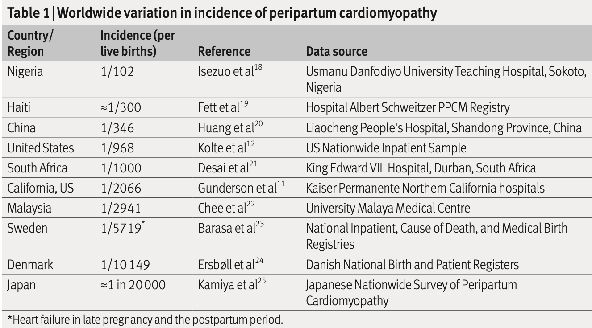
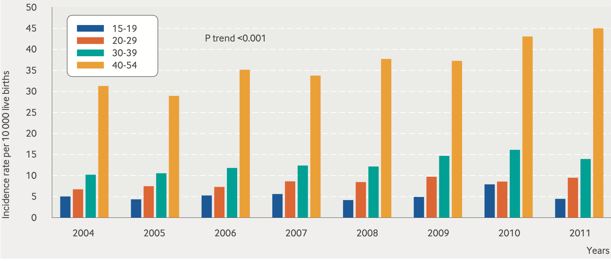
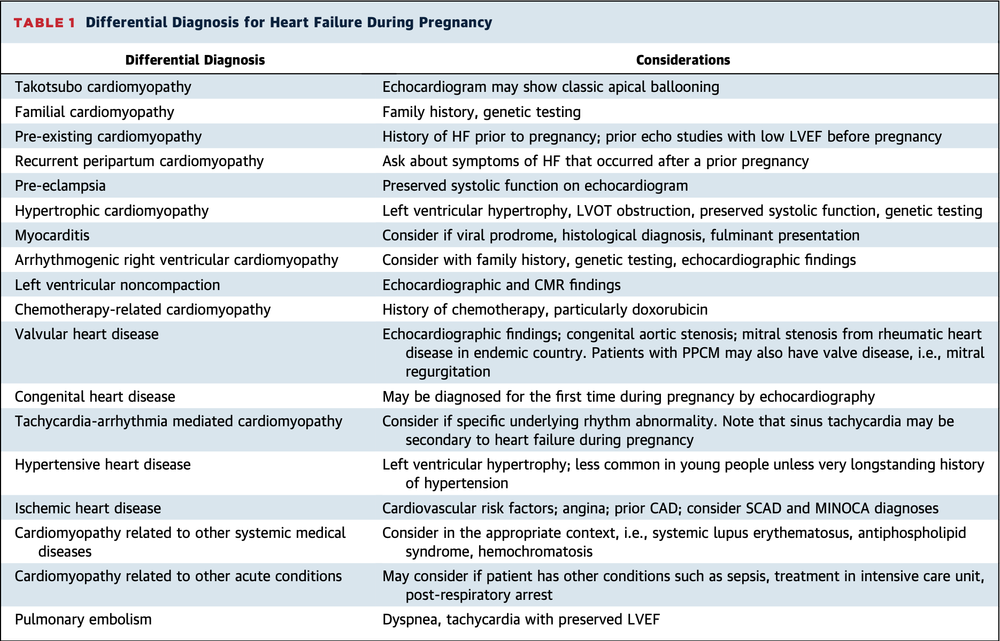
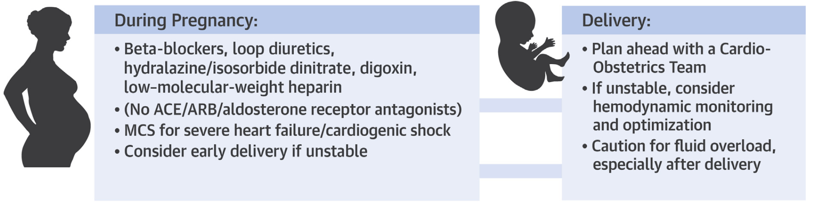
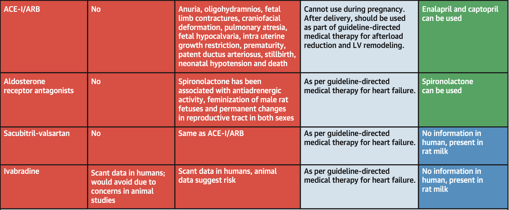
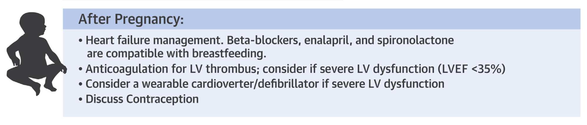
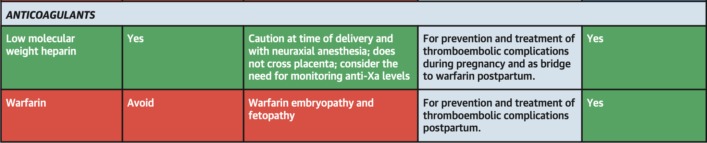
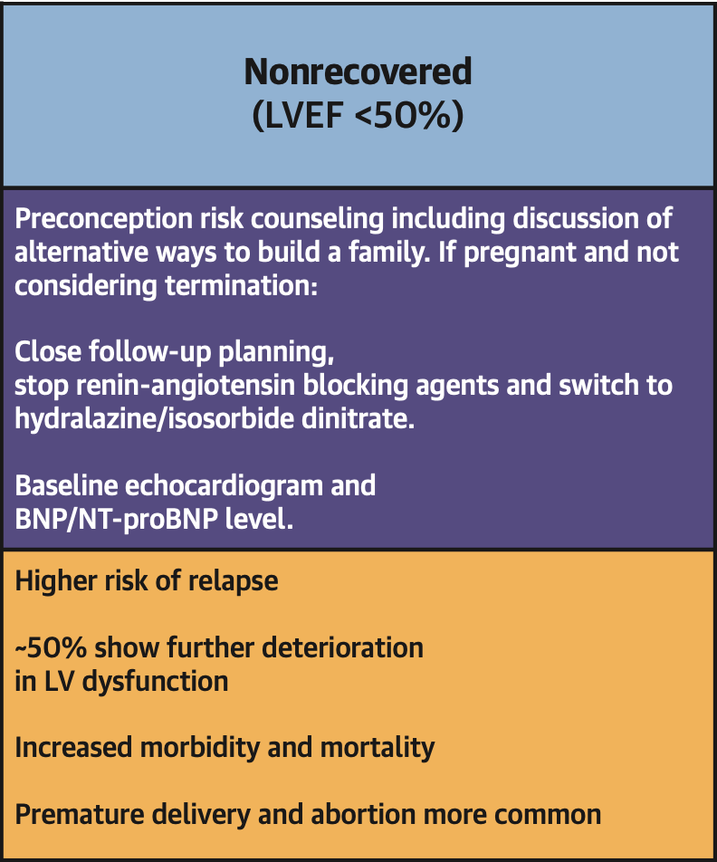

```{r setup, echo = FALSE, include = FALSE}
library(tidyverse)

print.tbl_df <- function(x, ...) {
	print.data.frame(x, right = FALSE, ...)
	invisible(x)
}

# Options
options(digits = 0)
```

class: center, middle, inverse
# History and Physical

---

.pull-left[
### HPI
- 37 year old women, G6P5, pending Caeserean section this admission
- History of pre-eclampisa with first daughter (age 16)
- Three additional pregnancies without complications
- 5th pregnancy, delived in 12/2019, developed gestational hypertension
- Diagnosed with peripartum cardiomyopathy in 03/2020
- Delivery via C-section without complication, IUD placed afterwards
]

.pull-right[
### Social
- No toxic habits, compliant with medications

### Family
- Father died with cardiomyopathy in 50s
- Mother with hypertension

### Medications
- Carvedilol 25 mg PO BID
- Hydralazine 10 mg PO TID
- Furosemide 20 mg IV BID
- <font color="red">Allergies: penicillins, losartan</font>
]

---

.pull-left[
### Exam
- 140/87, <font color="red">134 kg</font>, HR 65, SaO2 97%
- Well-developed, well-nourished
- Moist oral mucosa
- Warm extremities, no edema, regular rate, normal S1/S2, intact distal pulses, <font color="red">jugular venous pulsations below level of clavicle</font>
- Clear lungs bilaterally
- Obese but soft abdomen, dressing in place
- Alert and oriented x 3
- Skin intact
- Normal mood, affect, and insight

]

.pull-right[
### Labs
- <font color="red">Central Venous O2 61%</font>
- Na 137
- K 4.1
- Cl 106
- CO2 22
- Cr 0.69
- Mag 1.7
- Bili 0.9
- Alk Phos 94
- pro-BNP 49
- Hb 12
- WBC 14

### Studies
- CXR: cardiomegaly without pulmonary edema
- ECG: NSR with $1^{st}$ degree AV block
]

---

background-image: url("cxr.png")
background-size: contain

---

background-image: url("ecg.png")
background-size: contain

---

background-image: url("plax-m-mode.png")
background-size: contain

---

background-image: url("plax-measurements.png")
background-size: contain

---

### Surface echocardiograms

**March 2020** ... <font color="red">Time of Initial Diagnosis</font>
- LV ejection fraction 20-25%
- LVIDD 6.2 cm
- Mildly dilated LA

**September 2020**
- LV ejection fraction of 20-25%
- LVIDD 6.6 cm
- Mildly dilated LA

**January 2021**
- LV ejection fraction of 25-30%
- LVIDD 5.4 cm

---

class: center, middle, inverse
# Peripartum Cardiomyopathy

---
## Overview

.center[
*An idiopathic cardiomyopathy presenting with HF secondary to LV systolic dysfunction towards the end of pregnancy or in the months following delivery, where no other cause of heart failure is found*
]

.pull-left[
### Characteristics
- rare, idiopathic, often dilated cardiomyopathy, with marked systolic dysfunction
- diagnosis of exclusion in women with systolic dysfunction
- LVEF <45% with/without dilation
]

.pull-right[
### Pathogenesis
- the **two hit** model of PPCM: 
	1. vascular insult due to hormonal effects of late pregnancy / early postpartum period
	2. underlying predisposition
]

---

background-image: url("pathogenesis.png")
background-size: contain

.pull-right[.center[.footnote[Honigber et al. 2017]]]

---

.pull-left[
### Genetics
- Variants seen in genes encoding sarcomeric proteins:
	- titin: **TTN** mutations most common and predictive
	- myosin
	- troponin

### Prolactin
- Secreted by anterior pituitary
- Cleaved by cardiomyocytes expressing cathepsin D enzyme
- Causes endothelial apoptosis and capillary dropout
- Bromocriptine shown to reverse PPCM in mice
]

.pull-right[
### Placental Factors
- high prevalence of pre-eclampsia in women with PPCM
- soluble fms-like tyrosine kinase recepter 1 (sFlt-1), anti-angiogenic protein, normally drops off after delivery *normally*
- sFlt-1 sequesters VEGF/PlGF
- sFlt-1 correlates with LV mass and global longitudinal strain
]

.footnote[Negoro et al. 2001; Honigberg et al. 2017]

---

### Epidemiology

Significant regional variations... in the US, 1 in 900 $-$ 4000 live births



.footnote[Honigberg et al. 2019]

---
### Risk Factors



.pull-left[
- increasing cardiovascular risk factors (HTN, CAD, DM, obesity)
- maternal age $> 30$ years
- pre-eclampsia
]

.pull-right[
- multiple gestation
- race $\rightarrow$ half of US cases are black women

]

.footnote[Kolte et al. 2014]

---
## Our Patient - Initial Diagnosis


.pull-left[
March 2020:

- 37 year old, black, multiparous women
- history of pre-eclampsia, including during 5th pregnancy (delivered in 12/2019, 4 months prior)
- morbid obesity
- gestational / essential hypertension

Discharged on:

- carvedilol 6.25 mg PO bid
- furosemide 20 mg PO qd
- losartan 25 mg PO bid
- LifeVest

]

.pull-right[
Initial imaging may include...

- labs: marked elevation of N-terminal pro-BNP and BNP
- electrocardiogram: non-specific abnormalities 
- chest roentgenogram: showing pulmonary venous congestion
- echocardiogram: LVEF < 45%, potential intracardiac thrombus
- cardiac MRI: similar reduced EF, but <font color="red">gadolinium is avoided</font>

.center[*Patient still considering breast feeding, and future children. Contraception deferred.*]

]

.footnote[Davis et al. 2020]

---
### Differential



---
### Outcomes

.pull-left[
**Adverse Events**
- brain injury
- cardiopulmonary arrest
- pulmonary edema
- thromboembolic complications
	- <font color="red">LV thrombus seen in ~1/7 initial TTE</font>
- mechanical circulatory support
- cardiac transplantation
- death
	- <font color="red">4 to 11% in US at 1 year</font>
]

.pull-right[
**Prognosis**
- LVEF < 30% most reliable predictor of adverse events 
- Black ethnicity associated with lower rates of recovery and higher mortality
- Biomarkers: troponin, pro-BNP, sFlt-1
- PPCM has higher rate of recovery than other forms of HFrEF 
	- 45 to 70% recovery by 2 years, with median recovery time of 8 months
]

.footnote[Amos et al. 2006; Cooper et al. 2012; Mahowald et al. 2019]

---
class: center, middle, inverse
# Management

---

background-image: url("monitoring.png")
background-size: contain

---
## During Pregnancy



Heart failure management during pregnancy requires special modifications for fetal safety:

- <font color="green">loop diuretics</font> - avoid hypovolemia/hypotension for placental perfusion
- <font color="green">beta blockers</font> - consider fetal bradycardia and hypoglycemia
- <font color="green">hydralazine and nitrates</font> - caution with hypotension
- <font color="green">digoxin</font> - no congenital defects

---



.pull-left[
- <font color="red">ACEi, ARB, and AA</font> can cause congential defects
	- this includes scubitril-valsartan
- <font color="red">ivabradine</font> - limited data
]

.pull-right[
During lactation, however, <font color="green">enalapril, captopril, and spironolactone</font> are safe.
]

.footnote[Davis et al. 2020]

---
## After Pregnancy



Most drugs are safe after pregnancy, and for lactation. 
- loop diuretics
- beta blockers
- hydralazine/nitrates
- digoxin
- enalapril/captopril
- spironolactone
- LMWH
- warfarin

---
## Anticoagulation

PPCM has higher incidence of LV thrombus and systemic thrombembolism higher risk due to hypercoagulable state. 



Anticoagulation indications:
- severely decreased LVEF in late pregnancy
	- AHA: LVEF < 30%
	- ESC: LVEF < 35%
- continued anticoagulation for 6-8 weeks post-partum
- LMWH prior to delivery
- warfarin after deliver (safe for lactation)

.footnote[Davis et al. 2020]

---
## Delivery

.pull-left[
**Approach**

- Multidisciplinary cardio-obstetrics team:
	- obstetrics
	- cardiology
	- maternal-fetal medicine
	- anesthesiology
	- nursing
	- pharmacy
	- social work
- Attempt vaginal delivery if stable (Cesarean delivery has higher risk of complications)
- Hemodynamic optimization prior to delivery
- Early delivery if worsening hemodynamics
]

.pull-right[
**Hemodynamics following delivery**

Volume increase:
- Removal of caval compression
- Autotransfusion due to uterine contractions
- Fluid mobilization and increased venous return

Increases risk of fluid overload and pulmonary edema post-delivery. Patients should be monitored for volume status for <font color="red">48 hours</font> after delivery.
]

---
## Our Patient - After Delivery

.pull-left[

- Monitored in cardiac ICU for 48 hours
- Goal CVP < 10
- Diuresed with furosemide IV

Discharged: 
- metoprolol tartrate 25 mg PO bid
- hydralazine 75 mg PO tid ... <font color="red">alternative: enalapril</font>
- LMWH (therapeutic) x 6 weeks (due to reduced EF)
- Discharged with LifeVest
- IUD placed for contraception
- Breastfeeding **not** associated with worse outcomes

]

.pull-right[

]

.footnote[Koczo et al. 2019; Arany & Feldman 2019; Davis et al. 2020]

---
## Bromocriptine

.pull-left[
**Description**
- Bromocriptine is dopamine agonist
- Inhibits release of prolactin
- Limits the apoptotic 16-kDa cleaved version of prolactin

**Pilot Study** - In South Africa, bromocriptine 2.5 mg PO bid x 2 weeks, followed by 2.5 mg qd x 6 weeks, showed greater improvement in LVEF at 6 months, N = 20

**REBIRTH - RCT** - Under evaluation currently, N = 200
]

.pull-right[
**Current Status**
- Bromocriptine considered experimental
- Class IIb from ESC 
- Therapeutic AC recommended due to increased thrombotic complications
- Limits lactation (as suppresses prolactin)
]

.footnote[Sliwa et al. 2010]

---
class: center, middle, inverse
# Thank You