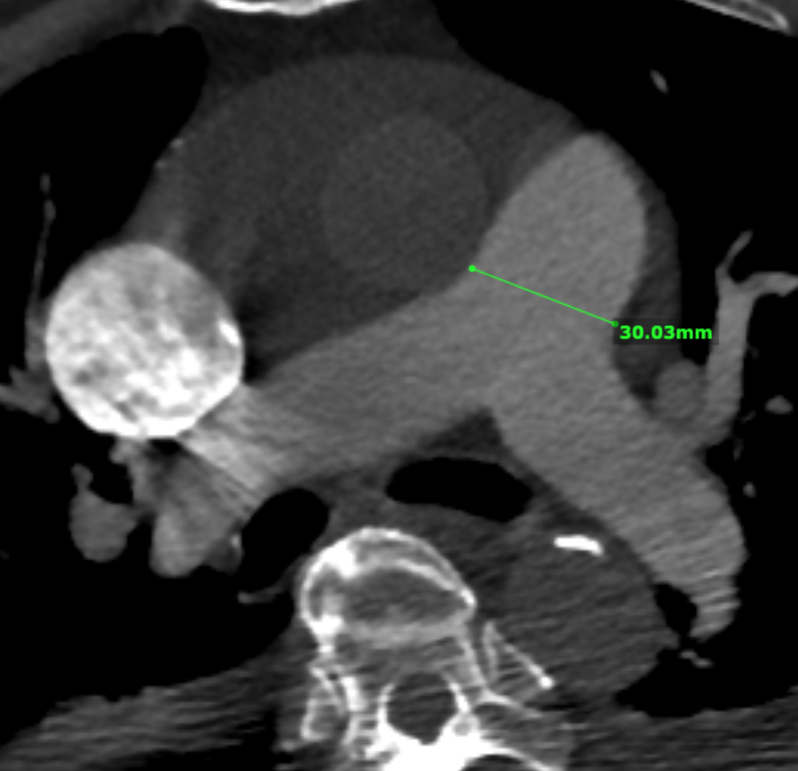
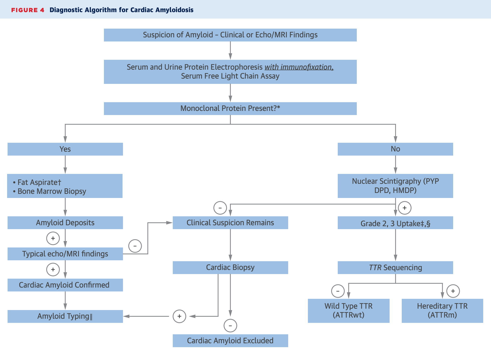
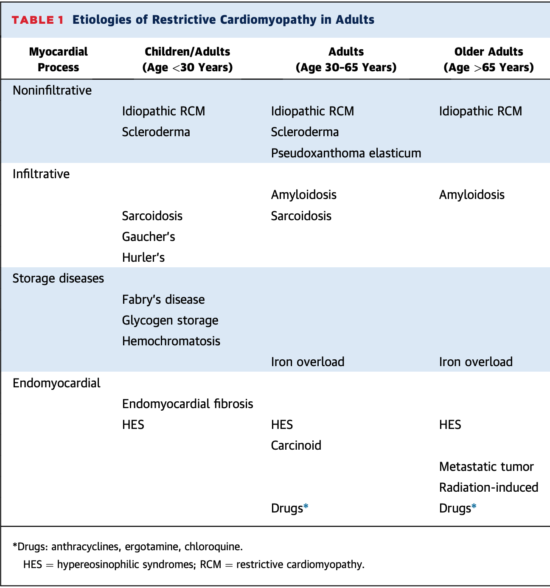
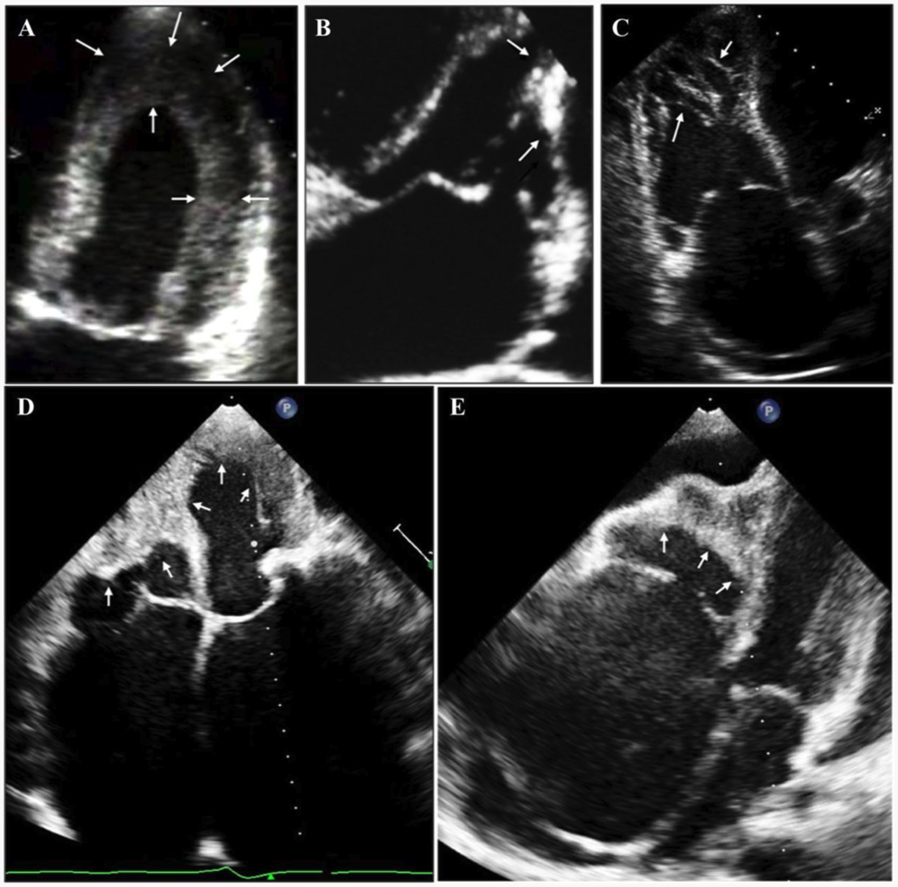
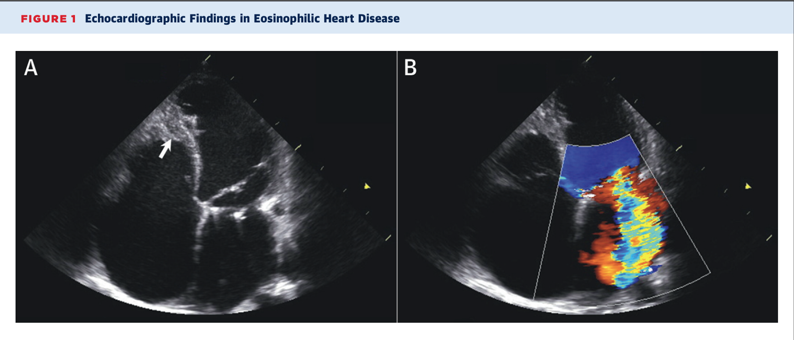
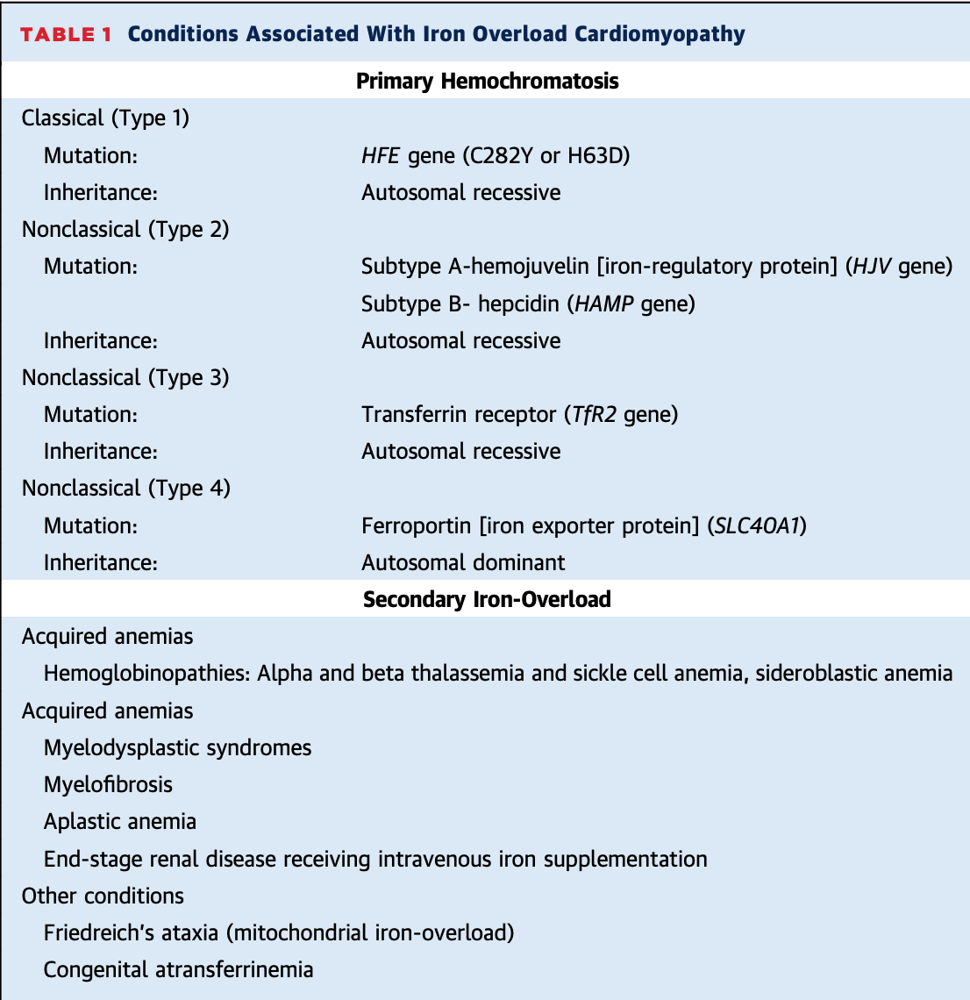

```{r setup, echo = FALSE, include = FALSE}
library(tidyverse)

print.tbl_df <- function(x, ...) {
	print.data.frame(x, right = FALSE, ...)
	invisible(x)
}

# Options
options(digits = 0)
```


background-image: url("scout-film.gif")
background-size: contain
class: center, middle, inverse
# <font color="black">The Case</font>

???
- This is the case
- Obvious has cardiomegaly
- Want to think through the differential of cardiomegaly in this patient

---
## Presentation

.pull-left[
**History**
- 84M from Burma/Myanmar
- HPI: P/w several days SOB, DOE, orthopnea, lower extremity edema, fatigue, anorexia, and productive cough
- PMHx: atrial dysrhythmia, cardiomegaly, orchitis s/p antibiotics
- Fam: No history of CVD
- Soc: Immigrated from Burma many years prior
- ROS: negative except post-tussive vomiting, occasional chest pain
- Meds: atenolol, furosemide 40, midodrine 5 qd
]

.pull-right[
**Physical**
- 171/110, HR 122, SaO2 86% on room air
- Elderly appearing male, Burmese speaking
- Alert, oriented
- Weak pulses in radial/DP sites bilaterally
- S1/S2, systolic murmur II/VI, irregular rate
- +2 pitting edema up to shins
- Bilateral crackles, diminished breath sounds
- Thin, scaphoid abdomen
]

---

.pull-left[
**CBC**
- Hemoglobin 12 
- Mean Corposcular Volume 87
- <font color="red">Platelets 112</font>

**Coags**
- Prothrombin Time 17
- <font color="red">INR 1.4</font>

**Chemistry**
- <font color="red">Sodium 120</font> 
- Chloride 88 
- Bicarbonate 24
- <font color="red">Creatinine 1.4</font> 
- Potassium 4.5 

**Liver Enzymes**
- AST 27
- ALT 20
- <font color="red">Total Bilirubin 1.7</font>

]

.pull-right[

**Other**
- Lactic acid 1.3
- <font color="red">D-dimer 3.1</font>
- Troponin 0.02
- <font color="red">Brain Natriuretic Peptide 508</font>
- Hemoglobin A1c 6.1%


]

---
background-image: url("ecg.png")
background-size: contain

???
- ECG shows very wide complex with RBBB
- **What is the rhythm?**
- Atrial flutter likely, but very low voltage
- Atrial rate is slow, FF interval > 300 ms

---
## Problem List


.right-column[
Hypoxia  

Hypervolemia

Hyponatremia  

Thrombocytopenia  

Coagulopathy

Atrial Fib/Flutter  

Right bundle branch block, 

QRS ~ 180 ms

Low P-wave voltage  

]

--

.left-column[

**Differential**

1. <font color="red">ADHF</font>  

1. PE  

1. Cirrhosis  

]

???
- Most likely diagnosis is ADHF
- Patient responds well to diuresis

---
## Differential...

.left-column[
AF/AFL  
RBBB  
HTN  
$\downarrow$ Na  
Tn = 0.02  
BNP = 508  
]

--

.right-column[
```{r first ddx, echo = FALSE, comment = "", highlight.output = c(1+2:3)}
ddx1 <- tribble(
	~"ddx",
	"ischemic cardiomyopathy",
	"hypertensive cardiomyopathy",
	"tachycardia-induced cardiomyopathy"
)
ddx1
```
]

???
So far these are far assumptions. No one thinks this is ischemic though once we get to Echo.

---
class: center, middle, inverse
# Surface Echocardiogram

---
background-image: url("plax.gif")

???
- Good ejection fraction based on mitral valve
- Atria look dilated
- Valve looks to be opening well
- Small pericardial effusion

---
background-image: url("m-mode-mitral.gif")

???
Can almost see flutter waves and disconnect between ventricular diastole (E') and A'

---
background-image: url("lvidd.gif")

???
- Mildly dilated LV
- Walls are not thick

---
background-image: url("plax-mr.gif")

???
- Note the eccentric mitral regurgitation
- Anterior mitral leaflet prolapse
- Severe mitral regurg (posteriorly-directed)

---
background-image: url("tr-jet.gif")

---
background-image: url("pr-jet.gif")

???
- Can estimate pulmonary diastolics here
- RA pressure ~ 20 mm Hg, thus PAD = 27 mmHg

---
background-image: url("apical.gif")

???
- Money shot
- Massively dilated atria

---
background-image: url("ivc.gif")

???
- IVC ~ 3 cm

---
background-image: url("ivc-flow.gif")
background-size: contain

???
- Inspiratory flow reversal?

---
## Calculations

.pull-left[
```{r TTE measurements}
# Basic measurements
SBP <- 93
DBP <- 47
HR <- 67
TR_vel <- 3.4
PR_peak <- 1.9
PR_end <- 1.3
IVC <- 3 
RAP <- 20
MR_vel <- 4.6
Ewave <- 14
Eprime <- (10 + 6)/2
AV_peak <- 1.3
LVOT <- 1.95
VTI_LVOT <- 14
VTI_AV <- 17
```
]

--

.pull-right[
```{r TTE right}
# Right sided calculations
PASP <- 4*TR_vel^2 + RAP 
PADP <- 4*PR_end^2 + RAP #<<
MPAP <- mean(
	0.61*PASP + 2,
	4*PR_peak^2 + RAP,
	2/3*PADP + 1/3*PASP #<<
)
PCWP <- Ewave/Eprime + 4 #<<
```

```{r TTE left}
# Left sided calculations
LAP <- SBP - 4*MR_vel^2 #<<
LVSP <- SBP + 0.7 * 4*AV_peak^2
SV <- pi*(LVOT/2)^2 * VTI_LVOT
CO <- SV * HR
```

]

???
- We can estimate a number of measurements from TTE to mimic RHC
- Three different methods to calculate mean PA pressures, all are +/- 5 from each other

Calculating LAP / PCWP... two methods:

1. Modified Nagueh formula (original = 1.24 * E/e' + 1.9)
2. If MR present, then SBP - MR gradient


---
## Differential...

.footnote[Rammos et al. 2017]

.left-column[
AF/AFL  
RBBB  
LVEF = 55%  
Dilated LV  
$\uparrow\uparrow\uparrow$ RA  
$\uparrow\uparrow$ LA  
TR/PR  
PA = `r PASP`/`r PADP`/`r MPAP`  
LAP = `r PCWP`-`r LAP`  
$\uparrow\uparrow\uparrow$ MR   
MV DT = 160   
]

--

.right-column[
```{r second ddx, echo = FALSE, comment = "", highlight.output = c(1+5:13)}
ddx2 <-
	ddx1 %>%
	add_row(ddx = c("rheumatic heart disease", "cardiac amyloidosis", "cardiac sarcoidosis", "endomyocardial fibrosis", "idiopathic restrictive cardiomyopathy", "Chagas disease", "Loeffler endocarditis", "hemochromatosis", "effusive-constrictive pericarditis", "pulmonary hypertension")) 

# print
ddx2
```
]


???

- Added on rheumatic disease that can cause LA enlargmenet
- Sarcoid and amyloid since anything could be presentation
- Rarer diseases like **endomyocardial fibrosis**
- Pulmonary hypertension of which type?
- Difficult to exclude restrictive (tall mitral E wave, quick DT of 160 ms)

---
background-image: url("ph-algorithm.png")
background-size: cover

.pull-left[
.footnote[Hansmann et al. 2019]
]

---
## Pulmonary Hypertension

```{r PH}
# Transpulmonary gradient
TPG <- MPAP - PCWP
# Diastolic pulmonary gradient
DPG <- PADP - PCWP
```

--

In this case, LV dysfunction is unlikely the culprit for RV failure, with TPG = `r TPG` and DPG = `r DPG`.

--

.pull-left[
1. PAH
1. ~~PH d/t LV dysfunction~~
1. PH d/t hypoxia
1. ~~CTEPH~~
1. Multifactorial PH
]

--

.pull-right[
*Precapillary Hypertension*

Drug/toxin induced  
Schistosomiasis  
Pulm. capillary hemangiomatosis  
ILD  
Myeloproliferative disorders  
Sarcoidosis  
Lymphagnioleiomyomatosis  
Fibrosing mediastinitis  
]

---
class: center, middle, inverse
# Cardiac MRI

---
background-image: url("mri-4-chamber.gif")
background-size: cover

---
background-image: url("mri-3-chamber.gif")
background-size: cover

---
background-image: url("mri-ra-view.gif")
background-size: cover

---
## Differential...

.left-column[
AF/AFL  
RBBB  
HTN  
$\uparrow \uparrow$ RA  
$\uparrow$ LA  
Dilated LV  
$\uparrow\uparrow\uparrow$ RA  
$\uparrow\uparrow$ LA  
TR/PR  
PA = `r PASP`/`r PADP`/`r MPAP`  
LAP = `r PCWP`-`r LAP`  
$\uparrow\uparrow\uparrow$ MR   
MV DT = 160   
No LGE  
Mod. PE
Burmese  
]

--

.right-column[
```{r third ddx, echo = FALSE, comment = "", highlight.output = c(1+c(5,6,8,10,13))}
ddx3 <-
	ddx2 %>%
	add_row(ddx = c("Sarcocystis", "meliodosis"))

# print
ddx3
```
]

???
- Tuberculosis can cause effusive-constrictive pericarditis
- Infectious patterns are less likely, but possible
- Sarcocystis is endemic to Burma
- Meliodosis (Burkholderia) rarer
- Chagas disease is not found in Burma or Southeast Asia

---
class: center, middle, inverse
# Diagnosis

---
background-image: url("restrictive-wu.jpg")
background-size: contain

---
## Key Findings in Restrictive Cardiomyopathy

.footnote[
Cooper et al. 2007
]

.pull-left[
**Exam**
- Exercise intolerance
- Prominent `x` and `y` descents without respiratory variation (negative Kussmaul's)
- S4 gallop

**Echo**
- Normal LVEF, BAE
- Restrictive diastolic filling 
	- $\uparrow$ E wave, $\downarrow$ A wave
	- E/A ratios $> 1.5$
	- $\downarrow$ mitral DT
	- $\downarrow$ IVRT (AV close...MV open)
- $\pm \uparrow$ LV wall thickness
]

--

.pull-right[
**CMR**
- T2 may show...
	- hyperintense, e.g. edema
	- decreased signal, e.g. iron overload
- LGE for infiltrative disease

**Cardiac Cath**
-  Reduced CI
- Elevated right/left pressures
- Square Root Sign 

**Endomyocardial Biopsy**
- Important, Class IIa recommendation

]


???

Square root sign = prominent early decrease in ventricular diastolic pressure with rapid rise to plateau

---
background-image: url("restrictive-echo-findings.png")
background-size: contain

???

Here are the key echo findings visualized

---
background-image: url("rv-tracing.png")
background-size: contain

.footnote[
Pereira et al. 2018
]

???

See square root sign here

---
## Cardiac Amyloidosis


.right-column[

]

AL/ATTR types  
Correct Dx 20%  
cMRI helpful

Our patient: 
- SPEP with abnormal gamma band (IFE with 40% IgM lambda chains)
- UPEP with $\uparrow$ lambda

.footnote[
Falk et al. 2016  
Pereira et al. 2018  
]

???

We do have abnormal light changes, but not slam dunk  
The CMRI is not necessarily 100% sensitive  

---
## Idiopathic Restrictive Cardiomyopathy

.pull-left[
- Rare disease that can present at any age 
- Usually with elevated BNP compared to constrictive pericarditis   
- $>15%$ are diagnosed $> 80$ years of age  
- No infiltrative component on imaging  
- Atrial fibrillation present in $3/4$ patients 
- Mutations: 
	- cardiac troponin I - *TNNI3*
	- beta-myosin heavy - *MYH7*
	- HCM
]

.pull-right[

]

.footnote[
Kushwaha et al. 1997   
Leya et al. 2005  
]

---
## Tropical Endomyocardial Fibrosis 

.pull-left[

]

.pull-right[
- More commonly seen in equatorial countries
- 20% of heart failure in equatorial Africa
- Bimodal distribution of 10 and 30 years of age
- Cassava plant contains cyanide, and *linamarin*, a cyanogenic glycoside 
- MRI shows extent of fibrosis with LGE
]

???

Not our patient because of geography and MRI findings

---
## Loeffler Endocarditis



Hypereosinophilia defined with >1.5k eosinophils. Usually between ages 20-50 years. CMR very effective. Three stages:
1. Acute necrotic phase
1. Intermediate phase with thrombus formation
1. Fibrotic stage with impaired cardiac function

---
## Iron Overload Cardiomyopathy

.pull-left[
**Primary Hemochromatosis**  

Type 1 = HFE gene, 30-40s  
Type 2 = HJV gene, juvenile type   
Type 3 = Transferrin receptor, 10-20s
Type 4 = Ferroportin, 30-40s  

In older adults, can occur with iron supplementation d/t underlying myelodysplastic syndromes or thalassemias
]

.pull-right[

]

.footnote[Murphy et al. 2010]

???

Not our patient once again, however does have thrombocytopenia  
May have thalassemia, from Asian descent  

---
## MOGES Classification

WHO adopted a new classification system for cardiomyopathies in 2013

.pull-left[
**M**orphological functional characteristics  
**O**rgan involvement  
**G**enetic inheritance pattern  
**E**tiological category  
**S**tatus by NYHA class and AHA stages  
]

.pull-right[
**Desmin-related RCM**

$M_{R(AVB)} O_{H+M} G_{AD} E_{G-Des} S_{C-III}$

- M = RCM with AV block
- O = Heart and Skeletal Muscle
- G = Autosomal Dominant
- E = mutation in desmin 
- S = AHA stage C, NYHA class III
]

---
class: center, middle, inverse
# Conclusion

---
background-image: url("restrictive-dx-age.jpg")
background-size: contain

---
## Final Thoughts

.footnote[
Nafissi et al. 2019  
Pereira et al. 2018
]

.pull-left[
### Working Diagnosis

- Precapillary hypertension with RA dilation, without RV dilation
- Supports restrictive/constrictive physiology

.center[*Potentially idiopathic restrictive cardiomyopathy* ]

]

--

.pull-right[
### Potential Next Steps

1. Right and left heart catheterization
1. Pulmonary function testing
1. Polysomnography
1. Infectious and auto-immune serologies
1. Endomyocardial biopsy
1. Hemoglobin electrophoresis
1. Iron studies
]

???

Emphasize the RHC/LHC  

Point of talk is to think through restrictive cardiomyopathy

Patients story, echo findings, MRI, and other clinical elements come together to reach this diagnosis - not made in isolation (not just an echo dx, or cath dx)

---
class: center, middle, inverse
# Thank you!