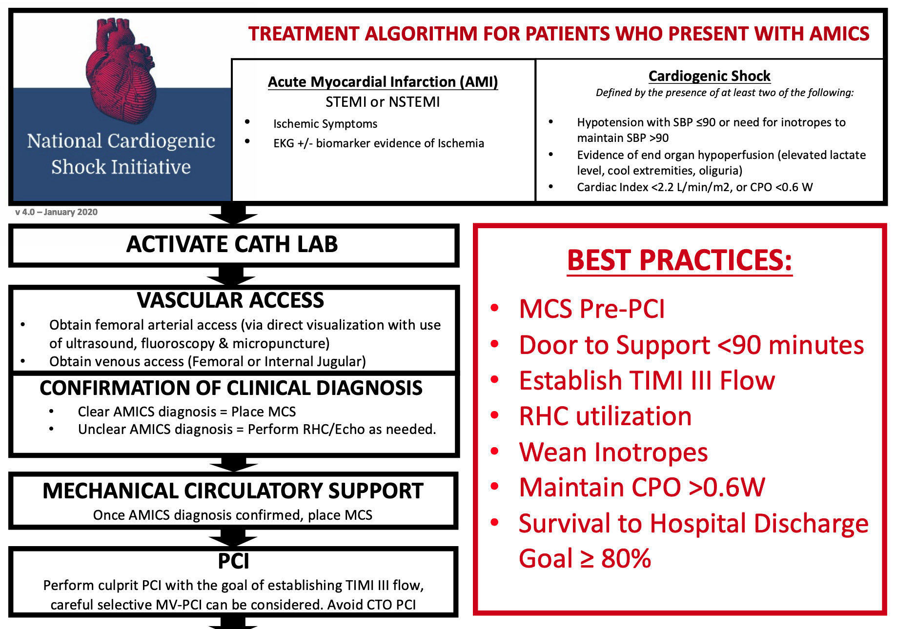

```{r setup, echo = FALSE, include = FALSE}
library(tidyverse)

print.tbl_df <- function(x, ...) {
	print.data.frame(x, right = FALSE, ...)
	invisible(x)
}

# Options
options(digits = 0)
```

```{r themer, echo=FALSE, include=FALSE, warning=FALSE}
library(xaringanthemer)
style_solarized_light()
```

class: center, middle, inverse
# Femoral Access

---

class: inverse
background-image: url("femoral-angiography.gif")
background-size: contain

.footnote[
Bagai, Latif, Pitta, Swaminathan, SCAI 2020
]


---

class: center, middle
# Getting Access

---

### Palpation and Landmarks

1. Find inguinal ligament by palpation of ASIS and pubic tubercle
1. At mid-point, find femoral pulse and move 2-3 cm inferiorly
1. Intend to puncture CFA 1-2 cm below inguinal ligament

.pull-left[
Advantages:
- Familiar however "old school"
- Rapid access (e.g. crash lines)
]

.pull-right[
Disadvantages:
- May not find inguinal ligament in obese patients
- Suboptimal access due to unvisualized needle trajectory
- Cannot account for anatomic variants (e.g. high bifurcations, plaque)
]

---

class: inverse
background-image: url("inguinal-crease.png")
background-size: contain

.footnote[
Bagai, Latif, Pitta, Swaminathan, SCAI 2020
]

---

### Fluoroscopic

1. Under fluoroscopy, position hemostat at inferior border of femoral head
1. Enter skin with needle at site
1. Aim to puncture CFA in middle third of femoral head

.pull-left[
Advantages:
- Effective in setting of weak pulse
- Presence or extent of calcification can be seen
]

.pull-right[
Disadvantages:
- Skin entry site may be different after local anesthetic injection
- Cannot account for high CFA birfurcation
]

---

class: inverse
background-image: url("fluoroscopy.png")
background-size: contain

.footnote[
Bagai, Latif, Pitta, Swaminathan, SCAI 2020
]

---

class: inverse
background-image: url("bifurcations.png")
background-size: contain

---

### Ultrasound

1. Image CFA in lon gand short axis to find bifurcation
1. Move superior to bifurcation 
1. Advance needle from 1-3 cm below US to vessel in short axis

.pull-left[
Advantages:
- Avoid plaque, calcification, and pulsatile femoral vein
- Avoids back-wall and side-wall punctures
- Allows for modified Seldinger's technique
]

.pull-right[
Disadvantages:
- Learning curve of using US
- Needle tip depth may be underestimated if visualizing needle body instead of tip
]

---

### HYBRID APPROACH

1. Use ASIS and pubic bone to identify inguinal ligament

1. Place hemostat 2-3 cm below site of femoral artery

1. Fluoroscopy to confirm femoral head location
1. Ultrasound to identify CFA and bifurcations inferiorly (NAVEL)

1. Local anesthetic at site

1. Micropuncture needle for access under ultrasound

1. Confirm wire trajectory running medially

1. Swap for appropriate sheath for intended procedure

---

class: center, middle
# Evidence and Complications

---

#### Ultrasound Usage

- As of 2017, 13% of cardiologists routinely used ultrasound for femoral access
- FAUST (Femoral Arterial Access with Ultrasound Trial) showed better high CFA cannulation (70% versus 83%) and decreased attempts (~3 versus ~1), comparing US to fluoroscopy
- Puncture below the bifurcation can lead to pseudoaneurysm, and incidental venous punctures can lead to fistula formation

#### Bleeding

- Major bleeding risk is 1-3%, with higher need for blood transfusions, length-of-stay, and 30-day mortality
- Increased risk when patient has been heparinized or on anticoagulation (compared to radial)

.footnote[
Doyle, Ting, and Bell, JACC Cardiovascular Interventions, 2008  
Valgimigli, Gagnor, and Calabro, Lancet, 2015
Pitta et al, Catheter Cardiovascular Interventions, 2011
Sandoval et al, JACC Cardiovascular Interventions, 2017
]

---

#### Comparing to Radial...

| Study | Name | Winning Approach |
| --- | --- | --- |
| RIVAL | Radial Versus Femoral Access for Coronary Intervention | Radial | 
| RIFLE-STEACS | Radial Versus Femoral Randomized Investigation in ST-Elevation Acute Coronary Syndrome | Radial |
| STEMI-Radial | ST Elevation Myocardial Infarction treated by Radial or Femoral Approach | Radial | 
| MATRIX | Minimizing Adverse Haemorrhagic Events by Transradial Access Site and Systemic Implementation of Angiox | Radial |
| SAFARI-STEMI | Safety and Efficacy of Femoral Access vs Radial Access in ST-Segment Elevation Myocardial Infarction | 

---

class: inverse
background-image: url("cto.png")
background-size: contain

---

#### Why Femoral?

- Large bore access, e.g. TAVR, MCS
- Aortic tortuosity and catheter engagement
- Biplane fluoroscopy

```{r, echo=FALSE, out.width = "80%", fig.align = "center"}

```


---

class: middle, inverse, center
# Thank You

