```{r setup, echo=FALSE, include=FALSE}
library(tidyverse)

# Clean printing
print.tbl_df <- function(x, ...) {
	print.data.frame(x, right = FALSE, ...)
	invisible(x)
}

# Options
options(digits = 0)
```

```{r, xaringan themer, include=FALSE, warning=FALSE}
# Xaringan theme
library(xaringanthemer)
style_solarized_light()
```

```{r, references, include=FALSE, cache=FALSE}
library(RefManageR)
BibOptions(
	check.entries = FALSE,
	style = "markdown",
	bib.style = "authoryear",
	max.names = 3,
	hyperlink = FALSE
)
bib <- ReadBib("./Cardiology.bib", check = FALSE)
```

class: middle, inverse
# Introduction

---

### Objectives

1. Be aware of the history of pharmacological therapies for improving myocardial inotropy

1. Obtain a general background in the cellular mechanics of myocardial contractility 

1. Understand the process of phases of drug development

1. Understand the methods and statistical techniques in survival analysis and mixed models.

1. Critically assess the results of a randomized clinical trial

---

### Systolic Heart Failure

- Characterized from dysfunction or loss of cardiomyocytes, resulting in...
	- Reduced contractility
	- Increased cardiac wall stress
- Compensatory mechanisms include:
	- neurohormal activation (both acute autonomic changes and persistent hormonal changes)
	- ventricular remodeling (leading to a *negative feedback cycle* of ever increasing myocardial oxygen demand and decreased efficiency)
	
<font size="5">
.center[Majority of drugs focus on blocking neurohormonal activation and remodeling, not on improving systolic function directly]

---

### Study Overview

**GALACTIC-HF** = Global Approach to Lowering Adverse Cardiac Outcomes Through Improving Contractility in Heart Failure

.pull-left[
#### Intervention
- Selective cardiac myosin activator, **omecamtiv mecarbil (OM)**, improves cardiac function
- Randomized to medicine or placebo

#### Population
- Chronic systolic heart failure on GDMT
]

.pull-right[
#### Methods
- Long-term follow-up (median ~ 2 years) for all events

#### Outcomes
- Heart-failure recurrence or cardiovascular mortality
- Quality of life and symptom burden
]

.footnote[`r Citet(bib, author = "Teerlink", year = "2021")`]

---

class: middle, inverse
# History of Inotropy

---

.pull-left[
### Inotropes

Calcitropes (raises intracellular $Ca^{++}$) have been the mainstay of improving systolic function.

.center[
**Milrinone**  
**Dobutamine**  
**Digoxin**  
Levosimendan  
Xamoterol  
Flosequinan  
Pimobendan  
Ibopamine  
Vesnarinone  
Enoximone  
Istaroxime  
Hawthorne
]
]

.pull-right[
### Others
- Angiotensin-converting-enzyme inhibitors (ACEI)

- Beta-adrenergic receptor blockers (BB)

- Mineralocorticoid antagonists (MRA)

- Angiotensin receptor-neprilysin inhibitors (ARNI)

- Sodium-glucose cotransporter 2 inhibitors (SGLT2) 
]


---

.footnote[`r Citet(bib, author = "Overgaard")`]

.left-column[
#### Catecholamines

Endogenous catecholamines:

- dopamine
- norepinephrine
- epinephrine

Synthetic catecholamines:

- dobutamine
- isoproterenol
- phenylephrine
]

.right-column[
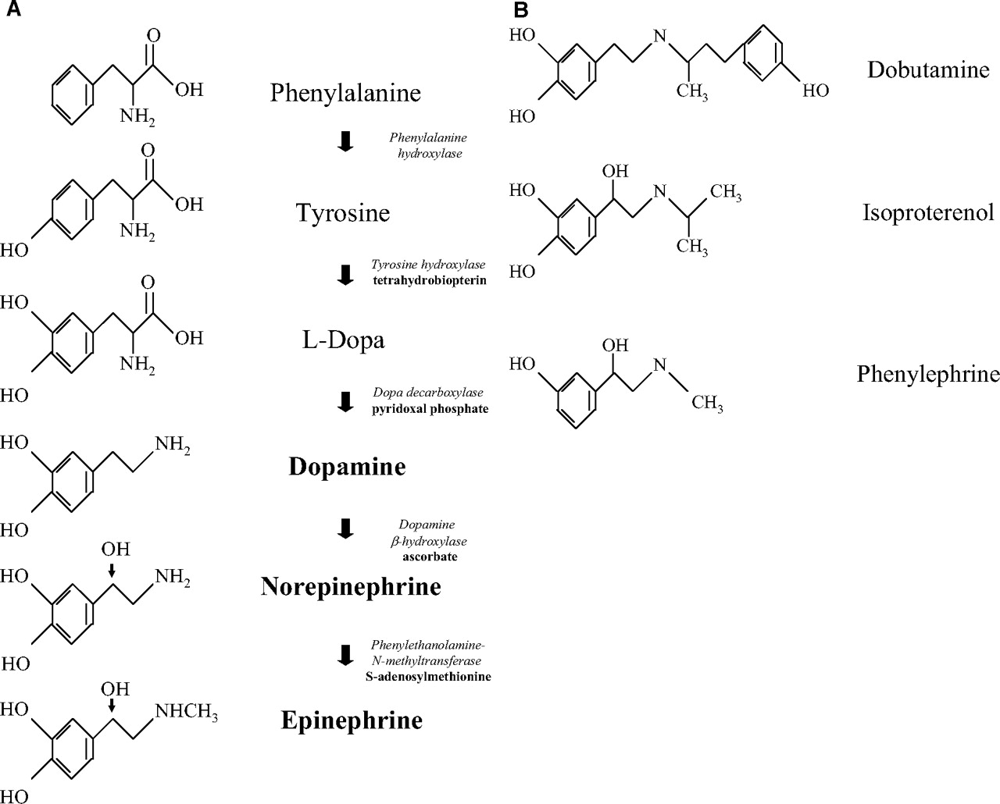
]

---

.footnote[`r Citet(bib, author = "Overgaard")`]

.left-column[
#### Mechanisms
A majority of pathways lead to increase cAMP signaling, causing increased calcium and subsequent inotropic effects.

Non-cAMP:

- flosequinan
- levosimendan
- digoxin
- istaroxime
]

.right-column[
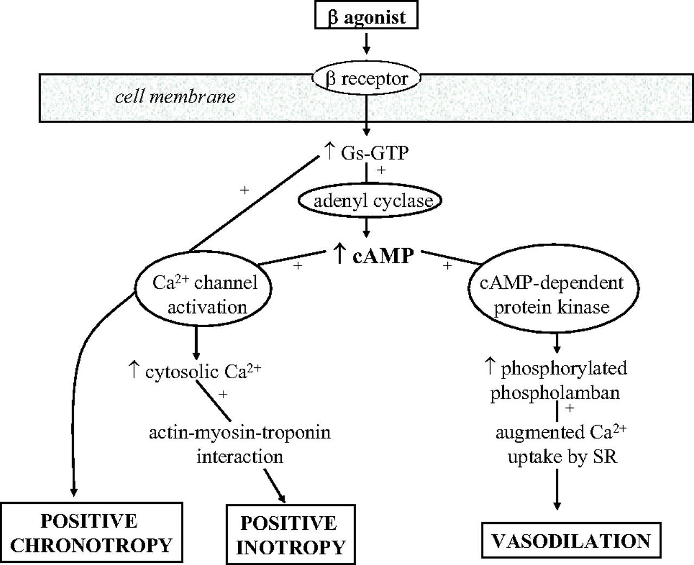
]

---

<font size="4">

| Drug | Mechanism |
| :--- | :--- |
| Dobutamine | $\beta$-adrenergy leads to cAMP-based phosphorylation of L-type $Ca$ channels and ryanodine receptors |
| Ibopamine | dopamine and $\alpha$ agonist with mild $\beta_{1}$ and $\beta_{2}$ agonism | 
| Xamoterol | $\beta_{1}$ selective/partial agonist |
| Milrinone, pimobendan, enoximone, vesnarinone | phosphodiesterase-3 inhibitors increase contractility by decreasing cAMP degradation, bypassing $\beta$-receptor, also potent vasodilator | 
| Flosequinan | increased cardiac contractility to reduce $Na/Ca$ exchange | 
| Levosimendan | increases cardiac myofilament $Ca$ sensitivity | 
| Istaroxime | inhibits $Na/K$ ATP-ase but also stimulates sarcoplasmic reticulum $Ca$ release |
| Digitalis/dixogin | inhibits $Na/K$ ATPase, increasing both intracellular sodium and $Ca$; decreases conduction through AV node through prolonged phase 4 and 0
| Hawthorn (crategus) extract | cAMP-independent inhibition of $Na/K$ ATPase, decreases nitric oxide degradation | 

---

| Indication | Effect |
| :- | :------------- |
| $\downarrow$CO from AMI | Dobutamine - without shock <br> Dopamine - with shock <br> *All causes increased $O_{2}$ consumption, arrhythmia, infarct* |
| CHF | Dobutamine - desensitization can occur <br> Milrinone - more pulmonary vasodilation <br> Levosimendan - potential mortality benefit over dobutamine <br> *Mortaliy of 80-90% in 1 year* |
| Cardiac Arrest | Epinephrine, vasopressin <br> |
| Post Cardiotomy | Dobtuamine, milrinone <br> *From cardioplegia, cross-clampnig, cardiac ischemia, reperfusion injury* | 
| RV Infarct | Norepinephrine - RV systolic perfusion <br> Dobutamine - myocardial contractility |
| Bradyarrhythmia | Dobutamine, dopamine, and isoproterenol |

.footnote[`r Citet(bib, author = "Follath")` (**LIDO**); `r Citet(bib, author = "Mebazaa")` (**SURVIVE**); `r Citet(bib, author = "Hershberger")` (**COSI**)]

---

background-image: url("calcitropy-failure.png")
background-size: contain

.footnote[`r Citet(bib, author = "Teerlink", year = "2020")`]

---
## Omecamtiv Mecarbil

Why do we need *another* drug?

- All prior increased mortality (except for digoxin)
- Similar mechanism of increased intracellular calcium and calcium sensitivity
- **Hypothesis**: direct activation of human sarcomere could augment contractility without similar adverse effects

What is **OM**?

- selective cardiac myosin activator
- increases myocardial contractility by binding to myosin at allosteric stie
- stabilizes lever arm of cardiac myosin in primed position
- increased myosin heads primed for powerstroke prior to contraction
- increased force generated 
- decreases ATP turnover
- no changes in $Ca$ currents

.footnote[`r Citet(bib, author = "Teerlink", year = "2020")`]

---

background-image: url("actin-mechanism.png")
background-size: contain

---

background-image: url("actin-sliding.png")
background-size: contain

---

.pull-left[
### Phase 1 

- Purpose is to test safety and dosage of drug
- Usually < 100 healthy voluneteers
- Study lasts < 3 months
- 70% of drugs move to next phase

### Phase 2 

- Purpose is to test efficacy and potential side effects
- Usually several hundred people with the targeted condition
- Study lasts several months to 2 years
- 33% of drugs move to next phase
]

.pull-right[
**OM** had dose-dependent increases in... 

- systolic ejection time
- stroke volume
- fractional shortening
- LV ejection fraction
- decreased ventricular volume

**OM** safety profile...

- symptomatic myocardial ischemia only at $\uparrow \uparrow$ plasma concentrations $>1200\ ng/mL$
- oral agents had low potential for drug-drug interactions
- no negative effects on exercise ability or heart rates
]

---

background-image: url("phases-om-table.png")
background-size: contain

---

.pull-left[
### ATOMIC-AHF

*Acute Treatment with Omecamtiv Mecarbil to Increase Contracitlity in Acute Heart Failure*

- Randomized ~600 patients with ADHF and LVEF $\leq$ 40%
- Gave 48-hour infusions of **OM** at ascending doses
- No statistical difference in dyspnea at end of 48 hours
- However in highest dose, nominal decrease in dyspnea compared to placebo
- Troponin levels higher than with placebo
]

.pull-right[
### COSMIC-HF

*Chronic Oral Study of Myosin Activation to Increase Contractility in Heart Failure*

- Evaluate role of **OM** over 20 weeks in stable HF in ~450 outpatients with LVEF $\leq$ 40%
- Gave oral dosing guided by trough plasma levels
- Showed stable pharmacokinetics
- Increased systolic ejection time towards normal
- Decreased ventricular wall stress 9lower NT-proBNP)
- Sympathetic withdrawal with decreased heart rates
- Increased troponin levels
]

.footnote[`r Citet(bib, author = "Teerlink", year = "2016")`]

---

background-image: url("cosmic-endpoints.png")
background-size: contain

---

class: middle, inverse
# Methods

---

.pull-left[
### Inclusion
- Eligibility age between 18 - 85 years 
- NYHA $\geq$ II
- LVEF $\leq$ 35%
- Inpatients or outpatients with hospitalization within last 1 year
- Sinus rhythm
  - NT-proBNP $\geq$ 400 pg/mL
  - BNP $\geq$ 125 pg/mL
- Atrial fibrillation/flutter
  - NT-proBNP $\geq$ 1200 pg/mL
  - BNP $\geq$ 375 pg/mL
- Receiving or eligible for GDMT
]

.pull-right[
### Exclusion
- Acute need for hemodynamic support (either chemical or mechanical)
- Recent ACS or cardiovascular interventional procedure
- Systolic pressures $<$ 85 mm Hg or $>$ 140 mm Hg*
- Indexed GFR $\leq$ 20 mL/min
- Heart rate $>$ 110 beats/min or $<$ 50 beats/min
]

.footnote[*Higher systolic pressures suggest patient had not been optimized]

---

### Trial Design

- Randomized in 1:1 ratio of **OM** or **placebo**, with intent-to-treat analysis
- Balanced blocks within strata of enrollment location (inpatient v. outpatient)
- Dosage:
  - Either 25 mg, 37.5 mg, or 50 mg 
  - Dosage based on clearance (plasma levels checked)
  - Post-randomization checks performed at 2-16 week intervals (increasing)
  - Dosing held temporarily in those with ACS

### Outcomes

- Primary: first heart-failure event* or CV death composite
- Secondary: CV death, Kansas City Cardiomyopathy Questionnaire (KCCQ), all-cause mortality, MACE

.footnote[*Defined as initiation or intensification of heart failure treatment. ]

---

## Statistics

- To achieve 90% power to detect $HR=0.80$, expected $N=8000$ subjects and $N=1600$ events
- $\alpha$ spending function with **Haybittle-Peto** approach, with final $\alpha=0.05$
- Evaluated time-to-event using Kaplan-Meier estimates and Cox proportional hazards models
  - Major exposure was trial drug (either **OM** or **placebo**)
  - Stratified with baseline hazards by randomization setting, geographic region
  - Adjusted for baseline GFR
- KCCQ symptom change evaluated using mixed models 
  - Fixed effects: baseline KCCQ, geographic region, GFR, visit, trial group, and interaction between trial group and visit
  - Random effects: randomization setting, repeat visits

---

.pull-left[
### Multiple Hypotheses
- Multiple interim analyses, and multiple secondary outcomes, lead to multiple hypothesis testing
- $\alpha$ can be "spent" in several ways to lead to an overall $\alpha=0.05$ 
- Using *Haybittle-Peto boundary*, can adjust p-value for overall testing
- In this study, 96% of the $\alpha$ was spent on CV death, and 4% on KCCQ/symptom burden, thus a final $\alpha=0.05$ was used
]

.pull-right[
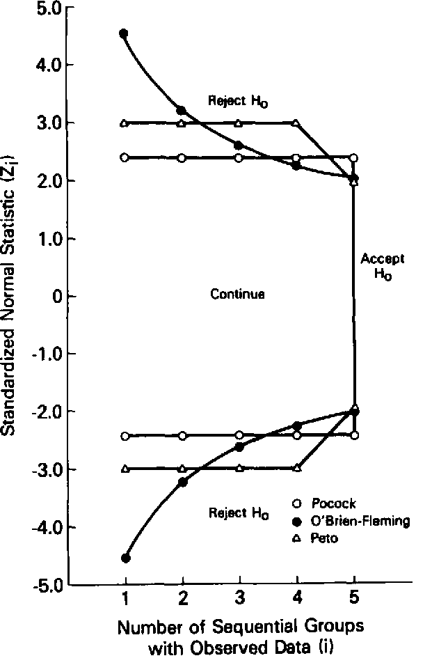
]

---

### Cox Proportional Hazard Models

$$ 
h(t) = h_{0}(t) ^ {\beta1 X1}
$$

- Assumes baseline hazard is proportional between groups
- Covariates are not assumed to vary with time (e.g. GFR is presumed to stay stable)
- Baseline hazard can be stratified 

.center[*Limitations*]

- The hazard is not necessarily proportional, as age and comorbidities are not encompassed
- The hazard ratio may actually be exponential (e.g. **Weibull** distribution - worsening HF will lead to increased events at an accelerating rate)

---

### Mixed Effect Models

- International study with different population/treatment strategies; inpatient/outpatient populations of different risk pools
- Using these as *random effects*, can measure the effect of the intervention and controlling for the differences in populations
- Allows for different slopes (or $\beta$ coefficients) by group

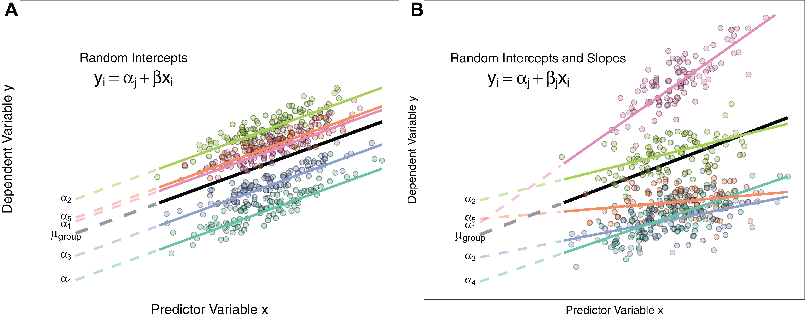

---

class: middle, inverse
# Results

---

### Patient Characteristics

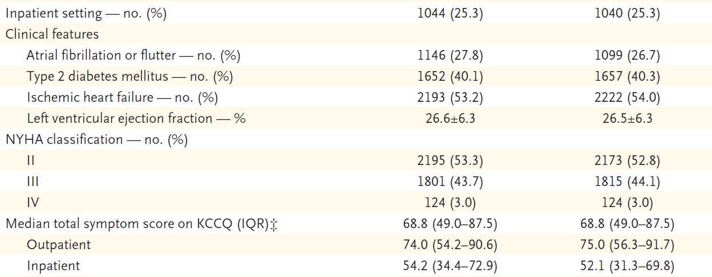

- Similar characteristics in both arms of the trial
- Only 3% of patient had NYHA IV symptoms

---

### Goal-Directed Medical Therapy


- Rare users of SGLT-2 inhibitors in all groups. 
- Use of ICD are much lower than expected in population with EF $\leq$ 35%
- Only 20% are on ARNI

---

## Outcomes

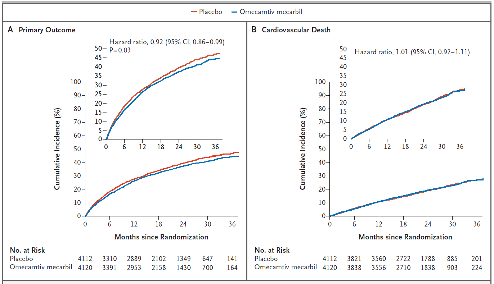

---

background-image: url("outcomes.png")
background-size: contain

---

.left-column[
<br>
Beneficial?

- Inpatient (only 25% of the enrolled subjects)
- North American
- Male
]

.right-column[
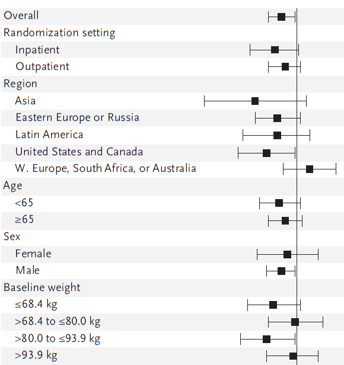
]

---

.left-column[
<br>
Beneficial?

- Increased symptom burden by NYHA III-IV 
- Ischemic etiology of heart failure
]

.right-column[


Is ischemic cardiomyopathy different somehow? Potential is a more homogenous cohort, compared to the different subtypes of non-ischemic cardiomyopathies. Also, myocardiocyte injury is not global. 
]

---

.left-column[
<br>
Beneficial?

- Sinus rhythm
- Severely reduced EF
- Volume overloaded
- Decreased systolic pressures
- Kidney function 
]

.right-column[.center[
```{r, echo=FALSE, out.width="90%" }
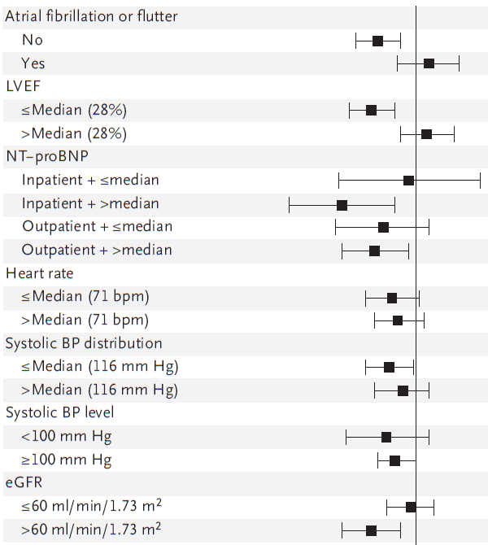
```
]]

---
.left-column[
<br>
Beneficial?

- Being on higher levels of GDMT (including ACEI, MRA)
- More severe cardiomyopathy, based on need for ICD/CRT
]

.right-column[
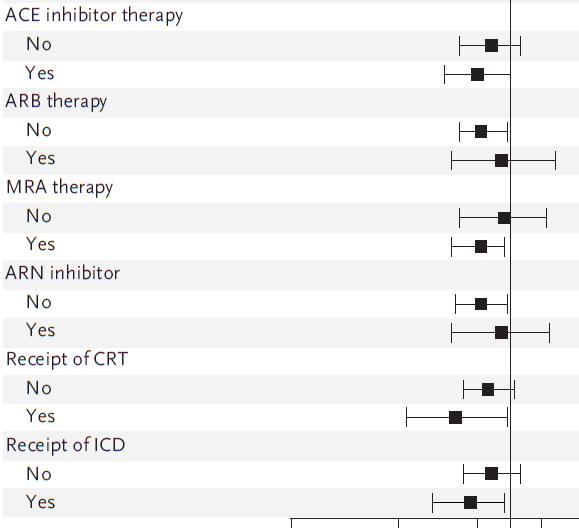
**However** ARNI not protective... potential *effect modifier* for primary outcomes.
]

---

### Medication Effects

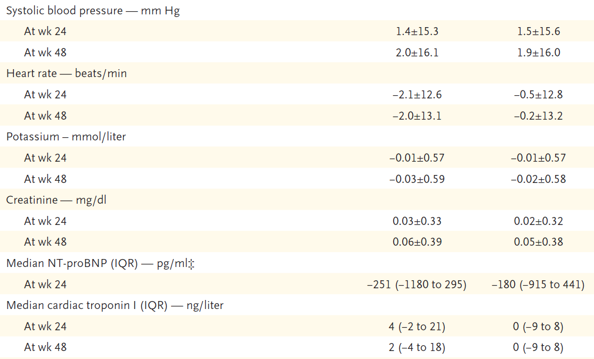

Overall: $\downarrow$ heart rate, $\downarrow$ NT-proBNP, and $\uparrow$ troponin

---

### Safety

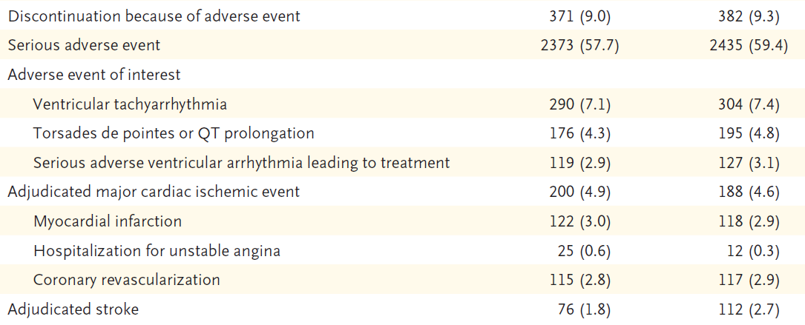

Overall: similar AE except $\downarrow \downarrow$ stroke in **OM**, roughly $\frac{2}{3}$ relative risk 

---

class: middle, inverse
# Discussion

---

## Key Findings

.left[
<font size="6">
Overall, **OM** had 8% lower RR, with an ARR of 2.1%, over 3 years.  

In NYHA $\geq$ III, **OM** had 12% lower RR

NT-proBNP at 6 months was 10% lower with **OM**

With **OM**, had 32% lower RR for stroke, with 0.9% ARR
]

<hr>

<font size="5">

.right[
$NNT = 48$ to prevent x1 HF or CV death event  
$NNT = 111$ to prevent x1 stroke event
]

---

## Limitations

.pull-left[
#### Generalizability
- Excluded those over > 85 years of age
- Excluded those with clinical instability
- Only 7% were Black
- Only 21% were women
]

.pull-right[
#### Context
- SGLT2 inhibitors were not compelling at time of enrollment (only 2% usage)
- Calcitropic agents were studied in times of limited GDMT 
- Systolic heart failure now has more nuance than prior studies have evaluated e.g. ICM vs. NICM
]

---

.pull-left[
#### Which subjects benefited the most? 

1. Inpatients with elevated NT-proBNP
1. North Americans (non-Hispanic)
1. Ischemic cardiomyopathy
1. Normal sinus rhythm
1. Severely reduced EF $\leq$ 28% and NYHA III-IV
1. eGFR $>$ 60 ml/min/1.73 m<sup>2</sup>
1. ACEI (*not ARB/ARNI*) therapy
1. CRT/ICD therapy

#### Which did not?

1. Western Europeans, South Africans, Australians
1. Atrial fibrillation/flutter
1. LVEF $>$ 28%
]

--

.pull-right[
#### **Why?**

- Symptomatic patients with worse contractility
- More severe cardiomyopathy
- Localized myocardiocyte damage (not global) from ischemia
- Decreased LV thrombus burden due to decreased LV strain
- Sinus rhythm allows for physiological ventricular filling
- Stable kidney function allows for improved/effective diuresis from concomitant GDMT 
]

---

class: inverse
## Objectives

--

1. Be aware of the history of pharmacological therapies for improving myocardial inotropy

--

1. Obtain a general background in the cellular mechanics of myocardial contractility 

--

1. Understand the process of phases of drug development

--

1. Understand the methods and statistical techniques in survival analysis and mixed models.

--

1. Critically assess the results of a randomized clinical trial

---

## References

<font size="2">

```{r, refs, echo=FALSE, results="asis"}
PrintBibliography(bib)
```

---

class: middle, inverse
# Thank you!