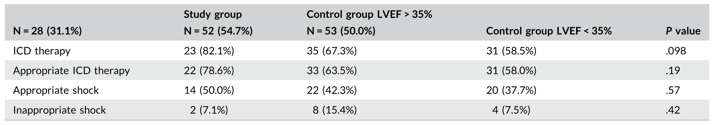

```{r setup, echo=FALSE, include=FALSE}
library(tidyverse) 
# Clean printing
print.tbl_df <- function(x, ...) {
	print.data.frame(x, right = FALSE, ...)
	invisible(x)
}

# Options
options(digits = 0)
```

```{r, xaringan themer, include=FALSE, warning=FALSE}
# Xaringan theme
library(xaringanthemer)
style_duo_accent(primary_color = "#091F40", secondary_color = "#AC1E2D")
```

```{r, references, include=FALSE, cache=FALSE}
library(RefManageR)
BibOptions(
	check.entries = FALSE,
	style = "markdown",
	bib.style = "authoryear",
	max.names = 3,
	hyperlink = FALSE
)
bib <- ReadBib("Cardiology.bib", check = FALSE)
```

class: middle, inverse
# Introduction

---

### Objectives

1. Know the difference between primary and secondary prevention for ICD

1. Understand the current guidelines for secondary prevention with ICD

1. Be aware of the major trials underlying the current recommendations for ICD

1. Understand the difference between reversible and non-reversible causes for secondary prevention

1. Assess the need for ICD in patients with ischemic heart disease

---

### Primary Prevention

| Trial | Year | Population | 
| --- | --- | --- | 
| MADIT | 1996 | Prior MI, EF < 35%, NSVT/VT | 
| MUSTT | 1999 | Prior MI, EF < 40%, NSVT/VT |
| CABG-Patch | 1997 | CAD, LVEF < 35%, CABG, abnormal signal-averaged ECG | 
| MADIT II | 2002 | Prior MI and LVEF < 30% | 
| DINAMIT | 2004 | MI within 40 days, LVEF < 35%, persistent tachycardia | 
| DEFINITE | 2004 | NICM, CHF, LVEF < 35%, NSVT |
| SCD-HeFT | 2005 | ICM, NICM, LVEF < 35%, NYHA > II | 

.footnote[`r Citet(bib, author = "Kedia")`]

---

### Secondary Prevention

| Trial | Year | Population | 
| --- | --- | --- | 
| AVID | 1997 | VF/VT, LVEF < 40%, syncope |
| CIDS | 2000 | VF, cardiac arrest, VT, LVEF <= 35% |
| CASH | 2000 | VT or VF | 

AVID (Antiarrythmic Versus Implantable Defibrillator) trial was first study for use of ICD as secondary prevention. N = 1000, VF survivors or VT with syncope or LVEF < 40%. ICD showed survival benefit over arrhythmia suppression.

.footnote[`r Citet(bib, author = "Kedia")`]

---

background-image: url("guidelines.png")
background-size: contain

.footnote[`r Citet(bib, author = "Al-Khatib")`]

---

class: middle, inverse
# 2018: ICD with Reversible Causes

.footnote[`r Citet(bib, author = "Ladejobi")`]

---

### Overview

- SCD survivors at a single institution with reversible cause
	- Electrolytes, metabolic derangements, acute myocardial ischemia/infarction, antiarrhythmic agents, drug use, etc...
- Retrospective cohort study
- Follow of ~ 4 years for overall mortality

> Current guidelines recommend implantable cardioverter- defibrillator (ICD) therapy in survivors of sudden cardiac arrest (SCA), except in those with completely reversible causes. We sought to examine the impact of ICD therapy on mortality in survivors of SCA associated with reversible causes.

---

.pull-left[
### Methods

- Survivors of SCD from 2000 to 2012 screened for reversible causes 
- Followed until death or until 2017
- SCD included ventricular fibrillation/flutter/tachycardia and cardiac arrest
- Reversible causes = electrolytes, metabolic, new antiarrhythmic drugs, illicit drug use, WPW, myocardial ischemia/infarction
]

.pull-right[
### Statistics

- Student *t*-test or Mann-Whitney *U* test for continuous variables
- $\chi^{2}$ test or Fisher exact test for discrete variables
- Time to event compared using Kaplan-Meier survival curves (compared between groups using log-rank test)
- Cox hazard models (proportional hazards assumptions met)
]


---

### Results


---


Shows that VF and VT made majority of cardiac arrest (when data was available). Half of events occurred as out-of-hospital arrests.

---

The frequency of revsible causes for SCD in the cohort show, when considering ACS, a strong skew towards myocardial **infarction**.


---

#### Comparing those with MI versus not in overall survival


---

class: middle

.pull-left[

]

.pull-right[
Overall, ICD placement and reversibility were main predictors for survival.

Atrial fibrillation increased mortality.
]

---

background-image: url("ladejobi-overview.png")
background-size: contain

---

.pull-left[
### Limitations

- No analysis of repeat events
- Retrospective study
- SCD "rare" in non-infarction pattern patients
- ACS determination (troponinemia d/t resuscitation)
- ICD data not available
]

.pull-right[
### Strengths

- All-comers for reversible causes
- High prevalence of CAD in patients
- Longitudinal outcomes with mortality data availble
- Studies a gap in guidelines 
]

---

class: middle, inverse
# 2020: ICD Implantation in ACS

.footnote[`r Citet(bib, author = "Dijk")`]

---

### Overview

- VA during ACS in patients with IHD but preserved EF
- Retrospective cohort study in those with ICD implantation
- ICD shock/therapy as primary outcome over 5 years follow-up

> In patients with a prior myocardial infarction (MI) but preserved left ventricular (LV) function, sustained ventricular arrhythmias (VAs) may arise in the setting of an acute coronary syndrome (ACS). It is unknown whether an implantable cardioverter‐defibrillator (ICD) is mandatory in these patients as VA might be triggered by a reversible cause. The purpose of this study is to analyze the benefit of ICD therapy in this patient population. 

---

.pull-left[
### Methods

- Retrospective study over 4 years (2008 to 2011)
- Enrolled those with prior MI, presented with VT/VF in setting of ACS, EF > 35%, **Group A**
- Control groups were those with IHD and VT/VF but without ACS (subdivided into group with preserved, **Group B**, and reduced EF, **Group C**)
- Measured appropriate ICD therapy, mortality, and inappropriate ICD therapy
]

.pull-right[
### Statistics
- two-tailed t-test for continuous variables
- $\chi^{2}$ test for categorical variables
- Kaplan-Meier survival analysis 
]

---

### Results

- N = 290 patients enrolled (~90-100 patients in each group)
- Mean age 67 years, 84% male
- Study group had 66% VF as index event, while controls were ~45% VF
- Mean LVEF was ~40% in **Group A**, and >90% had PCI/CABG at time of index event
- **Group C**, had CRT-D more often than those with preserved EF
- **Group C** had more vitamin K antagonists and loop diuretic usage than those with preserved EF
- In those without ACS, **Group B** and **C**, VT was more common as presenting rhythm

---

background-image: url("dijk-population-history.png")
background-size: contain

---

#### Outcomes

Primary outcomes were measured over a follow-up period of approximately 5 years. *Primary outcome = appropriate ICD therapy*


> In the study group A, 50.0% of the patients received ICD therapy (appropriate and inappropriate) vs 56.8% and 62.3% in the control groups (P = .23). Inappropriate shock rate was similar in all three groups (10.0%, 13.7%, and 7.5%, respectively; P = .36)

---

class: middle

#### Time until first event


---

class: middle

#### Overall survival


---

#### Ventricular Fibrillation


#### Ventricular Tachycardia



> In patients with VF at presentation, patients in group A had
significantly less (appropriate) ICD therapy compared to patients in control groups B and C (30.4% vs 39.0% and 69.8%; P < .01). No differences in inappropriate therapy were observed in patients presenting with VT.

---

.pull-left[
### Limitations

- No analysis of repeat events
- Limited power size
- Retrospective study (guidelines did not necessarily support ICD, thus "higher risk" likely)
- Unsophisticated statistical approaches (e.g. recurrent events, VT burden)
- ACS determination (troponinemia d/t resuscitation)
]

.pull-right[
### Strengths

- Preserved EF group
- Known CAD in patients
- Longitudinal outcomes with quantifiable data (e.g. ICD therapy, death)
- Studies a gap in guidelines 
]

---

class: middle, inverse
# 2021: ICD in CAD - PCI and MRI

.footnote[`r Citet(bib, author = "Lingen")`]

---

### Overview

- Retrospective cohort study
- Subjects received ICD implantation for secondary prevention in those with CAD
- Both angiography and MRI performed
- Followed time to appropriate ICD therapy

> In survivors of sudden cardiac arrest with obstructive coronary artery disease, it remains challenging to distin- guish ischemia as a reversible cause from irreversible scar-related ventricular arrhythmias. We aimed to evaluate the value of implantable cardioverter-defibrillator (ICD) implantation in sudden cardiac arrest survivors with presumably reversible ischemia and complete revascularization.

---

.pull-left[
### Methods

- Retrospective observational cohort study
- Enrolled survivors of SCD (VT or VF) with CAD who received ICD
- Followed between 2011 to 2018 (median f/u of 4 years)
- Angiography and MRI performed in patients
- Cohort divided into guideline-based ICD (e.g. irreversible ischemic substrate, reduced EF, recurrent VA) and off-label ICD (revascularized and LVEF > 35%)
- CMR with LGE done on large subgroup, scar defined as >50% thickness LGE
]

.pull-right[
### Statistics
- Kaplan-Meier curves stratified by group
- Cox proportional hazard models used with time-to-event defined as first appropriate device therapy
]

---

### Results


---

The amount of appropriate device therapies was similar between guideline-based ICD placement, and off-label ICD usage.

Frequency of ICD shocks was similar between groups.

Mortality was similar between groups as well.


---

background-image: url("lingen-adt-time.png")
background-size: contain

---

background-image: url("lingen-km-curve.png")
background-size: contain

---

background-image: url("lingen-cto.png")
background-size: contain

---

.pull-left[
### Limitations

- Small study population / power
- "Off-label" ICD was likely placed in higher risk patients (as it strayed from guidelines during study period)
- Control group unavailable (no ICD)
]

.pull-right[
### Strengths

- Included repeat device therapy events
- Known CAD in patients
- Incorporated CMR and LGE as potential parameter
- Studies a gap in guidelines 
]

---

class: middle, inverse
# Conclusion

---

## References

<font size="2">

```{r, refs, echo=FALSE, results="asis"}
PrintBibliography(bib)
```

---

class: middle, inverse, center
## Thank you!

*Please direct questions to our EP faculty and fellows.*